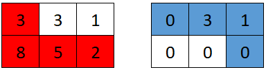

# 2017 Grid Game

You are given a 0-indexed 2D array grid of size 2 x n, where grid[r][c] represents the number of points at position (r, c) on the matrix. Two robots are playing a game on this matrix.

Both robots initially start at (0, 0) and want to reach (1, n-1). Each robot may only move to the right ((r, c) to (r, c + 1)) or down ((r, c) to (r + 1, c)).

At the start of the game, the first robot moves from (0, 0) to (1, n-1), collecting all the points from the cells on its path. For all cells (r, c) traversed on the path, grid[r][c] is set to 0. Then, the second robot moves from (0, 0) to (1, n-1), collecting the points on its path. Note that their paths may intersect with one another.

The first robot wants to minimize the number of points collected by the second robot. In contrast, the second robot wants to maximize the number of points it collects. If both robots play optimally, return the number of points collected by the second robot.
 
[LeetCode](https://leetcode.cn/problems/grid-game/description/)

### Example 1


```
Input: grid = [[2,5,4],[1,5,1]]
Output: 4
Explanation: The optimal path taken by the first robot is shown in red, and the optimal path taken by the second robot is shown in blue.
The cells visited by the first robot are set to 0.
The second robot will collect 0 + 0 + 4 + 0 = 4 points.
```

### Example 2



```
Input: grid = [[3,3,1],[8,5,2]]
Output: 4
Explanation: The optimal path taken by the first robot is shown in red, and the optimal path taken by the second robot is shown in blue.
The cells visited by the first robot are set to 0.
The second robot will collect 0 + 3 + 1 + 0 = 4 points.
```

### Constraints

* grid.length == 2
* n == grid[r].length
* 1 <= n <= 5 * 10<sup>4</sup>
* 1 <= grid[r][c] <= 10<sup>5</sup>

### C++ 

```
class Solution {
public:
    long long gridGame(vector<vector<int>>& grid) {
        /*
            第一個的目標，使第二個的得分最少
            第二個的目標，使得分最大
            當第一個走完，第二個只會有兩種走法，右邊到底再下/先下再右邊到底
            使用prefix
            遍曆第一個在各個轉彎位置時二個的得分
        */
        const int colLen = grid[0].size();
        vector<vector<long long>> prefix(2, vector<long long>(colLen + 1));
        for(int row = 0; row < grid.size(); ++row){
            for(int col = 1; col <= colLen; ++col){
                prefix[row][col] = prefix[row][col - 1] + grid[row][col - 1];
            }
        }
        //遍曆第一手從第i個位置轉彎時，第二手的得分
        long long ret = LLONG_MAX;
        long long maxScore = 0;
        for(int i = 1; i <= colLen; ++i){
            maxScore = prefix[0].back() - prefix[0][i];//第二手向右到底的得分
            maxScore = max(maxScore, prefix[1][i - 1] - prefix[1][0]);
             ret = min(ret, maxScore);  
        }

        return ret;             
    }
};
```