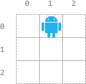

# 2120 Execution of All Suffix Instructions Staying in a Grid

There is an n x n grid, with the top-left cell at (0, 0) and the bottom-right cell at (n - 1, n - 1). You are given the integer n and an integer array startPos where startPos = [startrow, startcol] indicates that a robot is initially at cell (startrow, startcol).

You are also given a 0-indexed string s of length m where s[i] is the ith instruction for the robot: 'L' (move left), 'R' (move right), 'U' (move up), and 'D' (move down).

The robot can begin executing from any ith instruction in s. It executes the instructions one by one towards the end of s but it stops if either of these conditions is met:

* The next instruction will move the robot off the grid.
* There are no more instructions left to execute.
Return an array answer of length m where answer[i] is the number of instructions the robot can execute if the robot begins executing from the ith instruction in s.
 
[LeetCode](https://leetcode.cn/problems/execution-of-all-suffix-instructions-staying-in-a-grid/)

### Example 1



```
Input: n = 3, startPos = [0,1], s = "RRDDLU"
Output: [1,5,4,3,1,0]
Explanation: Starting from startPos and beginning execution from the ith instruction:
- 0th: "RRDDLU". Only one instruction "R" can be executed before it moves off the grid.
- 1st:  "RDDLU". All five instructions can be executed while it stays in the grid and ends at (1, 1).
- 2nd:   "DDLU". All four instructions can be executed while it stays in the grid and ends at (1, 0).
- 3rd:    "DLU". All three instructions can be executed while it stays in the grid and ends at (0, 0).
- 4th:     "LU". Only one instruction "L" can be executed before it moves off the grid.
- 5th:      "U". If moving up, it would move off the grid.
```

### Example 2


```
Input: n = 2, startPos = [1,1], s = "LURD"
Output: [4,1,0,0]
Explanation:
- 0th: "LURD".
- 1st:  "URD".
- 2nd:   "RD".
- 3rd:    "D".
```

### Constraints

* m == s.length
* 1 <= n, m <= 500
* startPos.length == 2
* 0 <= startrow, startcol < n
* s consists of 'L', 'R', 'U', and 'D'.

### C++ 

```
class Solution {
public:
    vector<int> executeInstructions(int n, vector<int>& startPos, string s) {
        /*
            滑動窗口的方式不行
            只能模擬
        */
        using iPair = pair<int,int>;
        unordered_map<char, iPair> dirMap = {{'R', {0, 1}}, {'L', {0, -1}}, {'U', {-1, 0}}, {'D', {1, 0}}};
        
        vector<int> ret;

        for(int i = 0; i < s.length(); ++i){
            int row = startPos[0] + dirMap[s[i]].first;
            int col = startPos[1] + dirMap[s[i]].second;
            int j = i;
            while(j < s.length() && row < n && row >= 0 && col < n && col >= 0){
                ++j;
                row += dirMap[s[j]].first;
                col += dirMap[s[j]].second;
            }

            ret.push_back(j - i);
        }

        return ret;
    }
};
```