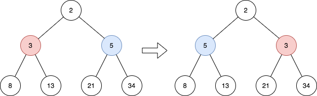

# 2415 Reverse Odd Levels of Binary Tree

Given the root of a perfect binary tree, reverse the node values at each odd level of the tree.

* For example, suppose the node values at level 3 are [2,1,3,4,7,11,29,18], then it should become [18,29,11,7,4,3,1,2].
Return the root of the reversed tree.

A binary tree is perfect if all parent nodes have two children and all leaves are on the same level.

The level of a node is the number of edges along the path between it and the root node.
 
[LeetCode](https://leetcode.cn/problems/reverse-odd-levels-of-binary-tree/)

### Example 1



```
Input: root = [2,3,5,8,13,21,34]
Output: [2,5,3,8,13,21,34]
Explanation: 
The tree has only one odd level.
The nodes at level 1 are 3, 5 respectively, which are reversed and become 5, 3.
```

### Example 2


```
Input: root = [7,13,11]
Output: [7,11,13]
Explanation: 
The nodes at level 1 are 13, 11, which are reversed and become 11, 13.
```

### Constraints

* The number of nodes in the tree is in the range [1, 2<sup>14<sup>].
* 0 <= Node.val <= 102<sup>5<sup>
* root is a perfect binary tree.

### C++ 

```
/**
 * Definition for a binary tree node.
 * struct TreeNode {
 *     int val;
 *     TreeNode *left;
 *     TreeNode *right;
 *     TreeNode() : val(0), left(nullptr), right(nullptr) {}
 *     TreeNode(int x) : val(x), left(nullptr), right(nullptr) {}
 *     TreeNode(int x, TreeNode *left, TreeNode *right) : val(x), left(left), right(right) {}
 * };
 */
class Solution {
public:
    TreeNode* reverseOddLevels(TreeNode* root) {
        deque<TreeNode*> que;
        que.push_back(root);
        int level = 0;

        while(!que.empty()){
            int len = que.size();
            if(level & 1){
                int left = 0; 
                int right = len - 1;
                while(left < right)
                    swap(que[left++]->val, que[right--]->val);
            }

            while(len--){
                TreeNode* curr = que.front();
                que.pop_front();
                if(curr->left)
                    que.push_back(curr->left);
                if(curr->right)
                    que.push_back(curr->right);
            }    
            ++level;        
        }
        
        return root;
    }
};
```