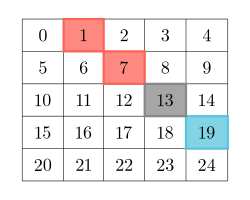

# 2711 Difference of Number of Distinct Values on Diagonals

Given a 2D grid of size m x n, you should find the matrix answer of size m x n.

The cell answer[r][c] is calculated by looking at the diagonal values of the cell grid[r][c]:

* Let leftAbove[r][c] be the number of distinct values on the diagonal to the left and above the cell grid[r][c] not including the cell grid[r][c] itself.
* Let rightBelow[r][c] be the number of distinct values on the diagonal to the right and below the cell grid[r][c], not including the cell grid[r][c] itself.
* Then answer[r][c] = |leftAbove[r][c] - rightBelow[r][c]|.
A matrix diagonal is a diagonal line of cells starting from some cell in either the topmost row or leftmost column and going in the bottom-right direction until the end of the matrix is reached.

* For example, in the below diagram the diagonal is highlighted using the cell with indices (2, 3) colored gray:
    * Red-colored cells are left and above the cell.
    * Blue-colored cells are right and below the cell.



Return the matrix answer.

[LeetCode](https://leetcode.cn/problems/difference-of-number-of-distinct-values-on-diagonals/description/)

### Example 1

```
Input: grid = [[1,2,3],[3,1,5],[3,2,1]]

Output: Output: [[1,1,0],[1,0,1],[0,1,1]]

Explanation:

To calculate the answer cells:
```

### Example 2

```
Input: grid = [[1]]

Output: Output: [[0]]
```

### Constraints

* m == grid.length
* n == grid[i].length
* 1 <= m, n, grid[i][j] <= 50


### C++ 

```
class Solution {
public:
    vector<vector<int>> differenceOfDistinctValues(vector<vector<int>>& grid) {
        /*
            1.值埴為1 - 50, 可以用一個uint64記下出現的數字
            2.從左上角開始先登記目前出現多少種數字，記在ret裡
              再記下目前的數字
            3.從右下且開開始登記，同樣先記下有多少種數字，與ret同位子的相減
              再記下數字
        */
        const int& rowNum = grid.size();
        const int& colNum = grid[0].size();
        vector<vector<int>> ret(rowNum, vector<int>(colNum));
        //登計first row從左上到右下
        for(int i = 0; i < colNum; ++i){
            int row = 0;
            int col = i;
            uint64_t cnt = 0;
            while(row < rowNum && col < colNum){
                ret[row][col] = __builtin_popcountll(cnt);
                cnt |= 1ULL << grid[row++][col++];
            }
        }
        // first colum from second to last
        for(int i = 1; i < rowNum; ++i){
            int row = i;
            int col = 0;
            uint64_t cnt = 0;
            while(row < rowNum && col < colNum){
                ret[row][col] = __builtin_popcountll(cnt);
                cnt |= 1ULL << grid[row++][col++];
            }
        }
        //處理從右下到左上，先處理水平部份
        for(int i = 0; i < colNum; ++i){
            int row = rowNum -1;
            int col = i;
            uint64_t cnt = 0;
            while(row >= 0 && col >= 0){
                ret[row][col] = abs(ret[row][col] - __builtin_popcountll(cnt));
                cnt |= 1ULL << grid[row--][col--];
            }
        }
        //last col
        for(int i = rowNum - 2; i >= 0; --i){
            int row = i;
            int col = colNum -1;
            uint64_t cnt = 0;
            while(row >= 0 && col >= 0){
                ret[row][col] = abs(ret[row][col] - __builtin_popcountll(cnt));
                cnt |= 1ULL << grid[row--][col--];
            }
        }

        return ret;        
    }
};
```