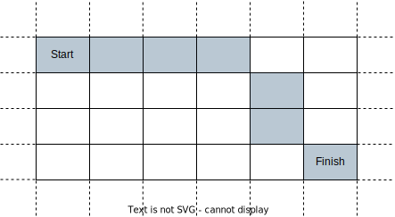

# 2849 Determine if a Cell Is Reachable at a Given Time

You are given four integers sx, sy, fx, fy, and a non-negative integer t.

In an infinite 2D grid, you start at the cell (sx, sy). Each second, you must move to any of its adjacent cells.

Return true if you can reach cell (fx, fy) after exactly t seconds, or false otherwise.

A cell's adjacent cells are the 8 cells around it that share at least one corner with it. You can visit the same cell several times.

[LeetCode](https://leetcode.cn/problems/determine-if-a-cell-is-reachable-at-a-given-time/description/)

### Example 1



```
Input: sx = 2, sy = 4, fx = 7, fy = 7, t = 6
Output: true
Explanation: Starting at cell (2, 4), we can reach cell (7, 7) in exactly 6 seconds by going through the cells depicted in the picture above. 
```

### Example 2

```
Input: sx = 3, sy = 1, fx = 7, fy = 3, t = 3
Output: false
Explanation: Starting at cell (3, 1), it takes at least 4 seconds to reach cell (7, 3) by going through the cells depicted in the picture above. Hence, we cannot reach cell (7, 3) at the third second.
```

### Constraints

* 1 <= sx, sy, fx, fy <= 10<sup>9</sup>
* 0 <= t <= 109


### C++ 

```
class Solution {
public:
    bool isReachableAtTime(int sx, int sy, int fx, int fy, int t) {
        /*
            忘了是什麼定理，因為可以走斜的，所以走到目標的最短時間會是
            min(diffX, diffY)，若要求的時間比這個小，就無法
        */
        if(fx == sx && fy == sy)
            return t != 1;

        return t >= max(abs(fx - sx), abs(fy - sy));        
    }
};
```