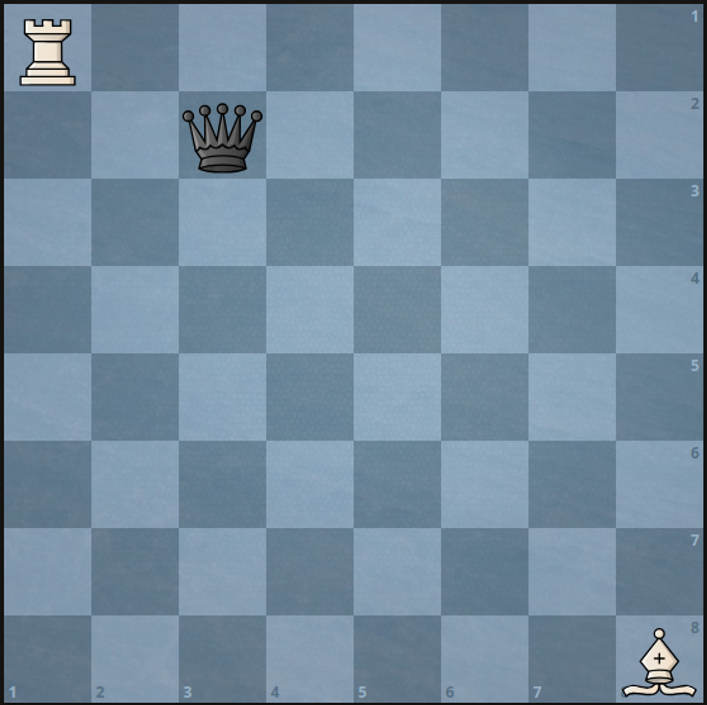

# 3001 Minimum Moves to Capture The Queen

There is a 1-indexed 8 x 8 chessboard containing 3 pieces.

You are given 6 integers a, b, c, d, e, and f where:

(a, b) denotes the position of the white rook.
(c, d) denotes the position of the white bishop.
(e, f) denotes the position of the black queen.
Given that you can only move the white pieces, return the minimum number of moves required to capture the black queen.

Note that:

Rooks can move any number of squares either vertically or horizontally, but cannot jump over other pieces.
Bishops can move any number of squares diagonally, but cannot jump over other pieces.
A rook or a bishop can capture the queen if it is located in a square that they can move to.
The queen does not move.

[LeetCode](https://leetcode.cn/problems/minimum-moves-to-capture-the-queen/description/)

### Example 1



```
Input: a = 1, b = 1, c = 8, d = 8, e = 2, f = 3
Output: 2
Explanation: We can capture the black queen in two moves by moving the white rook to (1, 3) then to (2, 3).
It is impossible to capture the black queen in less than two moves since it is not being attacked by any of the pieces at the beginning.
```

### Example 2

```
Input: a = 5, b = 3, c = 3, d = 4, e = 5, f = 2
Output: 1
Explanation: We can capture the black queen in a single move by doing one of the following: 
- Move the white rook to (5, 2).
- Move the white bishop to (5, 2).
```

### Constraints

* 1 <= a, b, c, d, e, f <= 8
* No two pieces are on the same square.


### C++ 

```
class Solution {
public:
    int minMovesToCaptureTheQueen(int a, int b, int c, int d, int e, int f) {
        /*
            以下情形時，只需一步就可以走到目標位
            1. 在車的水平或垂直線上
            2. 在象的對角線上
            其他狀況通通都需要走2步
        */
        //在同一水平線上，象不在同一水平線上或象也在同一水平線上，但位置比較遠
        if(a == e && (c != e || (f - b) * (f - d) < 0 || abs(f - b) < abs(f - d)))
            return 1;
        //同一垂直線上
        if(b == f && (d != f || (e - c) * (e - a) < 0 || abs(e - a) < abs(e - c)))
            return 1;
        
        // 目標在象的對角線上，斜率為1，-1
        bool slopeTar = abs(f - d) == abs(e - c);
        bool slopePeer = abs(b - d) == abs(a - c);
        if(slopeTar && (!slopePeer || (e - c) * (a - c) < 0 || (f - d) * (b - d) < 0 || (abs(e - c) < abs(a - c))))
            return 1;

        return 2;
        
    }
};
```