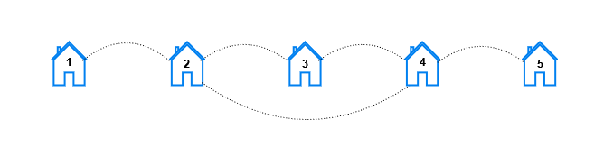

# 3015 Count the Number of Houses at a Certain Distance I

You are given three positive integers n, x, and y.

In a city, there exist houses numbered 1 to n connected by n streets. There is a street connecting the house numbered i with the house numbered i + 1 for all 1 <= i <= n - 1 . An additional street connects the house numbered x with the house numbered y.

For each k, such that 1 <= k <= n, you need to find the number of pairs of houses (house1, house2) such that the minimum number of streets that need to be traveled to reach house2 from house1 is k.

Return a 1-indexed array result of length n where result[k] represents the total number of pairs of houses such that the minimum streets required to reach one house from the other is k.

Note that x and y can be equal.

[LeetCode](https://leetcode.cn/problems/count-the-number-of-houses-at-a-certain-distance-i/description/)

### Example 1


```
Input: n = 3, x = 1, y = 3
Output: [6,0,0]
Explanation: Let's look at each pair of houses:
- For the pair (1, 2), we can go from house 1 to house 2 directly.
- For the pair (2, 1), we can go from house 2 to house 1 directly.
- For the pair (1, 3), we can go from house 1 to house 3 directly.
- For the pair (3, 1), we can go from house 3 to house 1 directly.
- For the pair (2, 3), we can go from house 2 to house 3 directly.
- For the pair (3, 2), we can go from house 3 to house 2 directly.
```

### Example 2



```
Input: n = 5, x = 2, y = 4
Output: [10,8,2,0,0]
Explanation: For each distance k the pairs are:
- For k == 1, the pairs are (1, 2), (2, 1), (2, 3), (3, 2), (2, 4), (4, 2), (3, 4), (4, 3), (4, 5), and (5, 4).
- For k == 2, the pairs are (1, 3), (3, 1), (1, 4), (4, 1), (2, 5), (5, 2), (3, 5), and (5, 3).
- For k == 3, the pairs are (1, 5), and (5, 1).
- For k == 4 and k == 5, there are no pairs.
```

### Constraints

* 2 <= n <= 100
* 1 <= x, y <= n


### C++ 

```
class Solution {
public:
    vector<int> countOfPairs(int n, int x, int y) {
        /*
            使用動態規劃找出點之間的最小值, Floyd算法
        */
        vector<vector<int>> dp(n + 1, vector<int>(n + 1, INT_MAX));
        if(x != y){
            dp[x][y] = 1;
            dp[y][x] = 1; //實上只會使用到一組
        }
        for(int start = 1; start < n; ++start){
            dp[start][start + 1] = 1;
            dp[start + 1][start] = 1;
        }

        // floyd算法
        for(int mid = 1; mid <= n; ++mid){
            for(int start = 1; start <= n; ++start){
                for(int end = 1; end <= n; ++end){
                    if(dp[start][mid] != INT_MAX && dp[mid][end] != INT_MAX){
                        dp[start][end] = min(dp[start][end], dp[start][mid] + dp[mid][end]);
                    }
                }
            }
        }
        
        vector<int> ret(n);
        for(int row = 1; row <= n; ++row){
            for(int col = 1; col <= n; ++col){
                if(row != col && dp[row][col] != INT_MAX)
                    ret[dp[row][col] - 1]++;
            }
        }

        return ret;
    }
};
```