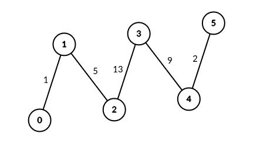
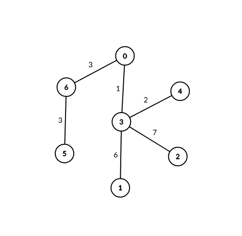

# 3067 Count Pairs of Connectable Servers in a Weighted Tree Network

You are given an unrooted weighted tree with n vertices representing servers numbered from 0 to n - 1, an array edges where edges[i] = [ai, bi, weighti] represents a bidirectional edge between vertices ai and bi of weight weighti. You are also given an integer signalSpeed.

Two servers a and b are connectable through a server c if:

* a < b, a != c and b != c.
* The distance from c to a is divisible by signalSpeed.
* The distance from c to b is divisible by signalSpeed.
* The path from c to b and the path from c to a do not share any edges.
Return an integer array count of length n where count[i] is the number of server pairs that are connectable through the server i.
 
[LeetCode](https://leetcode.cn/problems/count-pairs-of-connectable-servers-in-a-weighted-tree-network/)

### Example 1



```
Input: edges = [[0,1,1],[1,2,5],[2,3,13],[3,4,9],[4,5,2]], signalSpeed = 1
Output: [0,4,6,6,4,0]
Explanation: Since signalSpeed is 1, count[c] is equal to the number of pairs of paths that start at c and do not share any edges.
In the case of the given path graph, count[c] is equal to the number of servers to the left of c multiplied by the servers to the right of c.
```

### Example 2



```
Input: edges = [[0,6,3],[6,5,3],[0,3,1],[3,2,7],[3,1,6],[3,4,2]], signalSpeed = 3
Output: [2,0,0,0,0,0,2]
Explanation: Through server 0, there are 2 pairs of connectable servers: (4, 5) and (4, 6).
Through server 6, there are 2 pairs of connectable servers: (4, 5) and (0, 5).
It can be shown that no two servers are connectable through servers other than 0 and 6.
```

### Constraints

* 1 <= l <= r <= 10<sup>9</sup>
* -10<sup>4</sup> <= arr[i] <= 10<sup>4</sup>

### C++ 

```
class Solution {
protected:
    typedef pair<int, int> iPair; // {next, weight}
    int dfs(const int& node, const int& parent, const int& weight, const int& speed, const vector<vector<iPair>>& route){
        
        int ret = 0;
        for(const iPair& next : route[node]){
            if(next.first == parent)
                continue;
            int&& nodeCnt = dfs(next.first, node, weight + next.second, speed, route);
            ret += nodeCnt;
        }

        if(weight % speed == 0)
            ret += 1;

        return ret;
    }
public:
    vector<int> countPairsOfConnectableServers(vector<vector<int>>& edges, int signalSpeed) {
        /*
            遍歷節點，以該節點為根，其子樹符合條件的數目搭配起來
            
        */

        // 1. 先建立網路
        
        int&& len = edges.size() + 1;
        vector<vector<iPair>> route(len);
        for(const vector<int>& edge : edges){
            route[edge[0]].emplace_back(edge[1], edge[2]);
            route[edge[1]].emplace_back(edge[0], edge[2]);
        }
        
        // 2. 遍歷所有點，以該點為根
        vector<int> ret;
        for(int i = 0; i < len; ++i){
            int leftNodes = 0;
            int cnt = 0;
            for(const iPair& next : route[i]){
                int&& nodes = dfs(next.first, i, next.second, signalSpeed, route);
                cnt += nodes * leftNodes;
                leftNodes += nodes;
            }
            ret.push_back(cnt);   
        }

        return ret;
    }
};
```