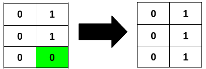

# 3239 Minimum Number of Flips to Make Binary Grid Palindromic I

You are given an m x n binary matrix grid.

A row or column is considered palindromic if its values read the same forward and backward.

You can flip any number of cells in grid from 0 to 1, or from 1 to 0.

Return the minimum number of cells that need to be flipped to make either all rows palindromic or all columns palindromic.
 
[LeetCode](https://leetcode.cn/problems/minimum-number-of-flips-to-make-binary-grid-palindromic-i/)

### Example 1


```
Input: grid = [[1,0,0],[0,0,0],[0,0,1]]

Output: 2

Explanation:
```

### Example 2



```
Input: grid = [[0,1],[0,1],[0,0]]

Output: 1

Explanation:
```

### Constraints

* m == grid.length
* n == grid[i].length
* 1 <= m * n <= 2 * 10<sup>5</sup>
 0 <= grid[i][j] <= 1

### C++ 

```
class Solution {
public:
    int minFlips(vector<vector<int>>& grid) {
        /*
            分別統計要成為回文需要翻多少為1，需注意當奇數時，中間的不需考慮
        */

        const int rowNum = grid.size();
        const int colNum = grid[0].size();
        if(rowNum == 0 || colNum == 0)
            return 0;

        int totalFlipRow = 0;
        for(int row = 0; row < rowNum; ++row){
            int left = 0, right = colNum - 1;
            int flipCnt = 0;
            while(left < right){
                if(grid[row][left] != grid[row][right]){
                    flipCnt += grid[row][left] ^ 1;
                    flipCnt += grid[row][right] ^ 1;
                }
                ++left;
                --right;
            }
            totalFlipRow += min(flipCnt, colNum - (colNum & 1) - flipCnt); //如果是奇數的話，中間的不用考慮
        }

        int totalFlipCol = 0;
        for(int col = 0; col < colNum; ++col){
            int left = 0, right = rowNum - 1;
            int flipCnt = 0;
            while(left < right){
                if(grid[left][col] != grid[right][col]){
                    flipCnt += grid[left][col] ^ 1;
                    flipCnt += grid[right][col] ^ 1;
                }
                ++left;
                --right;
            }
            totalFlipCol += min(flipCnt, rowNum - (rowNum & 1) - flipCnt);
        }
        
        return min(totalFlipRow, totalFlipCol);
    }
};
```