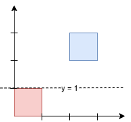

# 3453 Separate Squares I

You are given a 2D integer array squares. Each squares[i] = [xi, yi, li] represents the coordinates of the bottom-left point and the side length of a square parallel to the x-axis.

Find the minimum y-coordinate value of a horizontal line such that the total area of the squares above the line equals the total area of the squares below the line.

Answers within 10-5 of the actual answer will be accepted.

Note: Squares may overlap. Overlapping areas should be counted multiple times.

[LeetCode](https://leetcode.cn/problems/separate-squares-i/description/)

### Example 1



```
Input: squares = [[0,0,1],[2,2,1]]

Output: 1.00000

Explanation:

Any horizontal line between y = 1 and y = 2 will have 1 square unit above it and 1 square unit below it. The lowest option is 1.
```

### Example 2


```
Input: squares = [[0,0,2],[1,1,1]]

Output: 1.16667

Explanation:
```

### Constraints

* 1 <= squares.length <= 5 * 10<sup>4</sup>
squares[i] = [xi, yi, li]
squares[i].length == 3
0 <= xi, yi <= 10<sup>9</sup>
1 <= li <= 10<sup>9</sup>
The total area of all the squares will not exceed 10<sup>12</sup>.

### C++ 

```
class Solution {
protected:
    static constexpr double EPSILON = 1E-5;
    double getArea(const double& mid, const vector<vector<int>>& squares){
        double ret = 0.0;
        for(const vector<int>& square : squares){
            const int& edge = square[2];
            if(mid > square[1] + edge) //全都在線下方
                ret += 1.0 * edge * edge;
            else if(mid < square[1])  //全都在線上方
                continue;
            else
                ret += (mid - square[1]) * edge; 
        }

        return ret;
    }
public:
    double separateSquares(vector<vector<int>>& squares) {
        /*
            使用二分法
        */
        
        //1. 找出left, right
        double left = DBL_MAX;
        double right = DBL_MIN;
        double targetArea = 0.0;
        for(const vector<int>& square : squares){
            left = min(left, (double)square[1]);
            right = max(right, (double)(square[1] + square[2]));
            targetArea += (1.0 * square[2] * square[2]);
        }
        targetArea /= 2.0;
        while (abs(right - left) > EPSILON){
            double&& mid = (left + right) / 2.0;
            double&& lowArea = getArea(mid, squares);
            if(lowArea < targetArea) //線太低了
                left = mid;
            else //線太高了
                right = mid;
        }

        return (left + right) / 2.0;
    }
};
```