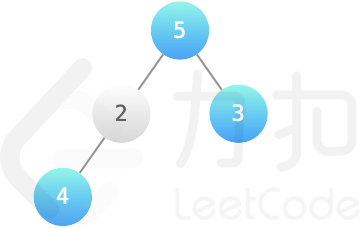
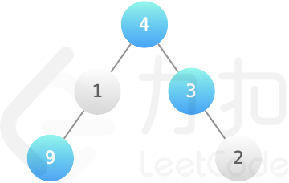

# LCP034 二叉樹染色

小扣有一個根結點為 root 的二叉樹模型，初始所有結點均為白色，可以用藍色染料給模型結點染色，模型的每個結點有一個 val 價值。小扣出於美觀考慮，希望最後二叉樹上每個藍色相連部分的結點個數不能超過 k 個，求所有染成藍色的結點價值總和最大是多少？
 
[LeetCode](https://leetcode.cn/problems/er-cha-shu-ran-se-UGC/)

### Example 1



```
輸入：root = [5,2,3,4], k = 2

輸出：12

解釋：結點 5、3、4 染成藍色，獲得最大的價值 5+3+4=12
```

### Example 2



```
輸入：root = [4,1,3,9,null,null,2], k = 2

輸出：16

解釋：結點 4、3、9 染成藍色，獲得最大的價值 4+3+9=16
```

### Constraints

* 1 <= k <= 10
* 1 <= val <= 10000
* 1 <= 結點數量 <= 10000


### C++ 

```
/**
 * Definition for a binary tree node.
 * struct TreeNode {
 *     int val;
 *     TreeNode *left;
 *     TreeNode *right;
 *     TreeNode(int x) : val(x), left(NULL), right(NULL) {}
 * };
 */
class Solution {
protected:
    vector<int> dfs(TreeNode* root, const int& k){
        vector<int> ret(k + 1);
        if(root == nullptr)
            return ret;
        
        vector<int>&& leftRes = dfs(root->left, k);
        vector<int>&& rightRes = dfs(root->right, k);

        // 該點不選，代表的是0個相連的
        ret[0] = *max_element(leftRes.begin(), leftRes.end()) + *max_element(rightRes.begin(), rightRes.end());

        for(int i = 1; i <= k; ++i){
            for(int j = 0; j < i; ++j){
                ret[i] = max(ret[i], root->val + leftRes[j] + rightRes[i - j - 1]);
            }
        }

        return ret;
    }
public:
    int maxValue(TreeNode* root, int k) {
        /*
            動態規劃，相連的結點數不能超過K
            1. 使用後序遍歷每一個節點，每一個節點都有兩個選擇，登記或不登記
            2. 不登記時，左右的子節點不若相連多少個(最多為K)，都可以，所以要找出最多的
            3. 登記時，該節點代表的可為1 - k個相連的節點，左分子對應數目為0 ~ k - 1
               右分支為 對應的數目  
        */

        auto ret = dfs(root, k);

        return *max_element(ret.begin(), ret.end());
    }
};
```