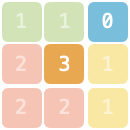
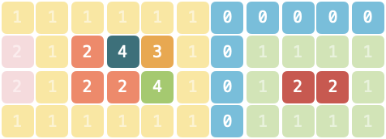

# LCS03 主題空間

「以扣会友」线下活动所在场地由若干主题空间与走廊组成，场地的地图记作由一维字符串型数组 grid，字符串中仅包含 "0"～"5" 这 6 个字符。地图上每一个字符代表面积为 1 的区域，其中 "0" 表示走廊，其他字符表示主题空间。相同且连续（连续指上、下、左、右四个方向连接）的字符组成同一个主题空间。

假如整个 grid 区域的外侧均为走廊。请问，不与走廊直接相邻的主题空间的最大面积是多少？如果不存在这样的空间请返回 0。
 
[LeetCode](https://leetcode.cn/problems/YesdPw/description/)

### Example 1



```
解释：4 个主题空间中，只有 1 个不与走廊相邻，面积为 1。
```

### Example 2



```
输入：grid = ["11111100000","21243101111","21224101221","11111101111"]

输出：3

解释：8 个主题空间中，有 5 个不与走廊相邻，面积分别为 3、1、1、1、2，最大面积为 3。
```

### Constraints

* 1 <= grid.length <= 500
* 1 <= grid[i].length <= 500
* grid[i][j] 仅可能为 "0"～"5"

### C++ 

```
class Solution {
public:
    int largestArea(vector<string>& grid) {
        /*
            每次碰到一個非0且未探索過的點，就將其放入隊列
            以其為目標開始拓展地圖，若某個點的鄰近點會出界，或是為0
            其不可納入計算
        */
        typedef pair<int,int> iPair;
        queue<iPair> que;
        int rowNum = grid.size();
        int colNum = grid[0].size();
        int moves[4][2] = {{-1,0},{1,0},{0,-1},{0,1}};

        int ret = 0;

        for(int row = 0; row < rowNum; ++row){
            for(int col = 0; col < colNum; ++col){
                if(grid[row][col] != '0' && grid[row][col] != '-'){
                    const char target = grid[row][col];
                    que.emplace(row, col);
                    grid[row][col] = '-';
                    bool valid = true;
                    int area = 1;
                    while(!que.empty()){
                        iPair curr = move(que.front());
                        que.pop();
                        for(int i = 0; i < 4; ++i){
                            int&& nextRow = curr.first + moves[i][0];
                            int&& nextCol = curr.second + moves[i][1];
                            if(nextRow < 0 || nextRow >= rowNum || nextCol < 0 || nextCol >= colNum || grid[nextRow][nextCol] == '0'){
                                valid = false;
                                continue;
                            }

                            if(grid[nextRow][nextCol] == target){
                                que.emplace(nextRow, nextCol);
                                grid[nextRow][nextCol] = '-';
                                ++area;
                            }
                        }
                    }
                    if(valid == true)
                        ret = max(ret, area);
                }
            }
        }
        
        return ret;
    }
};
```