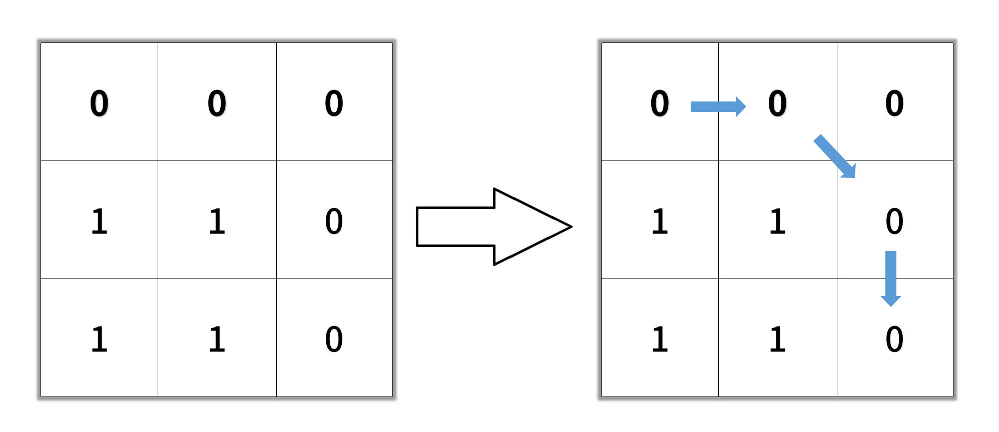

# 1091 二進制矩陣中的最短路徑

給你一個 n x n 的二進制矩陣 grid 中，返回矩陣中最短 暢通路徑 的長度。如果不存在這樣的路徑，返回 -1 。

二進制矩陣中的 暢通路徑 是一條從 左上角 單元格（即，(0, 0)）到 右下角 單元格（即，(n - 1, n - 1)）的路徑，該路徑同時滿足下述要求：

路徑途經的所有單元格都的值都是 0 。
路徑中所有相鄰的單元格應當在 8 個方向之一 上連通（即，相鄰兩單元之間彼此不同且共享一條邊或者一個角）。
暢通路徑的長度 是該路徑途經的單元格總數。


##  Shortest Path in Binary Matrix

Given an n x n binary matrix grid, return the length of the shortest clear path in the matrix. If there is no clear path, return -1.

A clear path in a binary matrix is a path from the top-left cell (i.e., (0, 0)) to the bottom-right cell (i.e., (n - 1, n - 1)) such that:

All the visited cells of the path are 0.
All the adjacent cells of the path are 8-directionally connected (i.e., they are different and they share an edge or a corner).
The length of a clear path is the number of visited cells of this path.

[LeetCode](https://leetcode-cn.com/problems/shortest-path-in-binary-matrix/)

### Example 1


```
Input: grid = [[0,1],[1,0]]
Output: 2
```

### Example 2



```
Input: grid = [[0,0,0],[1,1,0],[1,1,0]]
Output: 4
```

### Constraints

* n == grid.length
* n == grid[i].length
* 1 <= n <= 100
* grid[i][j] is 0 or 1

### C++ 

```
class Solution {
private:
    const int moves[8][2] = {{-1, 0}, {1, 0}, {0,-1}, {0, 1}, {-1,-1}, {-1,1}, {1,-1}, {1,1}};
    typedef pair<int, pair<int,int>> iPair;

    struct cmp{
        bool operator()(const iPair& lhs, const iPair& rhs){
            if(lhs.first == rhs.first)
                return lhs.second.first > rhs.second.first;
            return lhs.first > rhs.first;
        }
    };
public:
    int shortestPathBinaryMatrix(vector<vector<int>>& grid) {
        int&& sizeLen = grid.size();
        
        vector<vector<bool>> visted(sizeLen, vector<bool>(sizeLen, false));

        priority_queue<iPair, vector<iPair>, cmp>priQue;
        if(grid[0][0] == 0)
            priQue.emplace(1, make_pair(0,0));

        while(priQue.empty() != true){
            iPair curr = priQue.top();
            priQue.pop();

            const int& row = curr.second.first;
            const int& col = curr.second.second;

            if(visted[row][col] == true)
                continue;
            visted[row][col] = true;
        
            if(row == sizeLen - 1 && col == sizeLen - 1)
                return curr.first;            

            //下一個可能的點
            for(int i = 0; i < 8; ++i){ 
                int&& nexRow = row + moves[i][0];
                int&& nexCol = col + moves[i][1];
                if(nexRow >= 0 && nexRow < sizeLen && nexCol >= 0 && nexCol < sizeLen ){
                    if( grid[nexRow][nexCol] == 0 && visted[nexRow][nexCol] != true)
                        priQue.emplace(curr.first + 1, make_pair(nexRow, nexCol));
                }
            }

        }

        return -1;
    }
};
```
