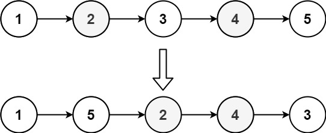

# 143 重排鍊表

給定一個單鏈表 L 的頭節點 head ，單鏈表 L 表示為：

L0 → L1 → … → Ln - 1 → Ln
請將其重新排列後變為：

L0 → Ln → L1 → Ln - 1 → L2 → Ln - 2 → …
不能只是單純的改變節點內部的值，而是需要實際的進行節點交換。

##  Reordered List

You are given the head of a singly linked-list. The list can be represented as:

L0 → L1 → … → Ln - 1 → Ln
Reorder the list to be on the following form:

L0 → Ln → L1 → Ln - 1 → L2 → Ln - 2 → …
You may not modify the values in the list's nodes. Only nodes themselves may be changed.

[LeetCode](https://leetcode-cn.com/problems/reorder-list/)

### Example 1


```
Input: head = [1,2,3,4]
Output: [1,4,2,3]
```

### Example 2



```
Input: head = [1,2,3,4,5]
Output: [1,5,2,4,3]
```

### Constraints

* The number of nodes in the list is in the range [1, 5 * 10<sup>4</sup>].
* 1 <= Node.val <= 1000

### C++ 

```
/**
 * Definition for singly-linked list.
 * struct ListNode {
 *     int val;
 *     ListNode *next;
 *     ListNode() : val(0), next(nullptr) {}
 *     ListNode(int x) : val(x), next(nullptr) {}
 *     ListNode(int x, ListNode *next) : val(x), next(next) {}
 * };
 */
class Solution {
public:
    void reorderList(ListNode* head) {
        /*
            1. 切鍊表切成兩部
            2. 後半部逆序
            3. 合併
        */

        /* 切成兩半 */
        ListNode* fast = head;
        ListNode* slow = head;
        while(fast->next != nullptr && fast->next->next != nullptr){
            fast = fast->next->next;
            slow = slow->next;
        }
        //重新將fast定義為後半部的首個點, 並從slow之後切斷
        fast = slow->next;
        slow->next = nullptr;

        /* 逆序 */
        ListNode* revHead = nullptr;
        while(fast != nullptr){
            ListNode* temp = fast;
            fast = fast->next;
            temp->next = revHead;
            revHead = temp;
        }
        //再將fast重新利用，定為head
        fast = head;

        /* Z字形聯結 */
        while(fast != nullptr && revHead != nullptr){
            ListNode* temp1 = fast;
            fast = fast->next;
            ListNode* temp2 = revHead;
            revHead = revHead->next;

            temp1->next = temp2;
            temp2->next = fast;
        }
    }
};
```
