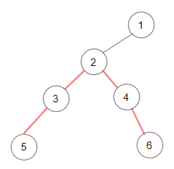

# 1522 N 叉樹的直徑

給定一棵 N 叉樹的根節點 root ，計算這棵樹的直徑長度。

N 叉樹的直徑指的是樹中任意兩個節點間路徑中 最長 路徑的長度。這條路徑可能經過根節點，也可能不經過根節點。


##  Diameter of N-Ary Tree

Given a root of an N-ary tree, you need to compute the length of the diameter of the tree.

The diameter of an N-ary tree is the length of the longest path between any two nodes in the tree. This path may or may not pass through the root.

(Nary-Tree input serialization is represented in their level order traversal, each group of children is separated by the null value.)

[LeetCode](https://leetcode-cn.com/problems/diameter-of-n-ary-tree/)

### Example 1


```
Input: root = [1,null,3,2,4,null,5,6]
Output: 3
Explanation: Diameter is shown in red color.
```

### Example 2



```
Input: root = [1,null,2,null,3,4,null,5,null,6]
Output: 4
```

### Constraints

* 1 <= nums.length <= 10<sup>5</sup>
* 1 <= nums[i] <= 10<sup>9</sup>
* 0 <= limit <= 10<sup>9</sup>

### C++ 

```
/*
// Definition for a Node.
class Node {
public:
    int val;
    vector<Node*> children;

    Node() {}

    Node(int _val) {
        val = _val;
    }

    Node(int _val, vector<Node*> _children) {
        val = _val;
        children = _children;
    }
};
*/

class Solution {
protected:
    int maxDiameter{0};
    int postOrder(const Node* root){
        int first = 0;
        int second = 0;
        
        for(const Node* next : root->children){
            int&& temp = postOrder(next);
            if(temp > first){
                second = first;
                first = temp;
            }
            else if(temp > second){
                second = temp;
            }
        }
        maxDiameter = max(maxDiameter, first + second);

        return first + 1;
    }

public:
    int diameter(Node* root) {
        /* postorder
            每一個節點的直徑是最大的兩個回傳值相加
            每一個節點的回傳值是最大的值
        */
        if(root == nullptr)
            return 0;

        (void)postOrder(root);

        return maxDiameter;
    }
};
```
