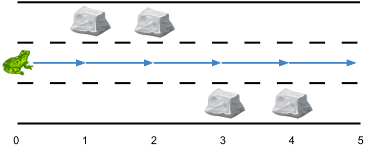

# 1824 最小側跳次數

給你一個長度為 n 的 3 跑道道路 ，它總共包含 n + 1 個 點 ，編號為 0 到 n 。一只青蛙從 0 號點第二條跑道 出發 ，它想要跳到點 n 處。然而道路上可能有一些障礙。

給你一個長度為 n + 1 的數組 obstacles ，其中 obstacles[i] （取值範圍從 0 到 3）表示在點 i 處的 obstacles[i] 跑道上有一個障礙。
如果 obstacles[i] == 0 ，那麽點 i 處沒有障礙。任何一個點的三條跑道中 最多有一個 障礙。

比方說，如果 obstacles[2] == 1 ，那麽說明在點 2 處跑道 1 有障礙。
這只青蛙從點 i 跳到點 i + 1 且跑道不變的前提是點 i + 1 的同一跑道上沒有障礙。為了躲避障礙，這只青蛙也可以在 同一個 點處 側跳 到 另外一條 跑道（這兩條跑道可以不相鄰），
但前提是跳過去的跑道該點處沒有障礙。

比方說，這只青蛙可以從點 3 處的跑道 3 跳到點 3 處的跑道 1 。
這只青蛙從點 0 處跑道 2 出發，並想到達點 n 處的 任一跑道 ，請你返回 最少側跳次數 。


##  Lowest Common Ancestor of a Binary Tree IV

There is a 3 lane road of length n that consists of n + 1 points labeled from 0 to n. A frog starts at point 0 in the second lane and wants to jump to point n. 
However, there could be obstacles along the way.

You are given an array obstacles of length n + 1 where each obstacles[i] (ranging from 0 to 3) describes an obstacle on the lane obstacles[i] at point i.
If obstacles[i] == 0, there are no obstacles at point i. There will be at most one obstacle in the 3 lanes at each point.

For example, if obstacles[2] == 1, then there is an obstacle on lane 1 at point 2.
The frog can only travel from point i to point i + 1 on the same lane if there is not an obstacle on the lane at point i + 1. To avoid obstacles, the frog can also perform a side jump to jump to another lane (even if they are not adjacent) at the same point if there is no obstacle on the new lane.

For example, the frog can jump from lane 3 at point 3 to lane 1 at point 3.
Return the minimum number of side jumps the frog needs to reach any lane at point n starting from lane 2 at point 0.

Note: There will be no obstacles on points 0 and n.

[LeetCode](https://leetcode-cn.com/problems/minimum-sideway-jumps/)

### Example 1


```
Input: obstacles = [0,1,2,3,0]
Output: 2 
Explanation: The optimal solution is shown by the arrows above. There are 2 side jumps (red arrows).
Note that the frog can jump over obstacles only when making side jumps (as shown at point 2).

```

### Example 2



```
Input: obstacles = [0,1,1,3,3,0]
Output: 0
Explanation: There are no obstacles on lane 2. No side jumps are required.
```

### Constraints

* obstacles.length == n + 1
* 1 <= n <= 5 * 10<sup>5</sup>
* 0 <= obstacles[i] <= 3
* obstacles[0] == obstacles[n] == 0

### C++ 

```
class Solution {
public:
    int minSideJumps(vector<int>& obstacles) {
        /* Dynamic Programming
           狀態轉移：每一個後面的狀態，先繼承前面的值，然後再比較其他行跳過來的值
           取較小者
        */
        int&& len = obstacles.size();
        int preDp[3] = {INT_MAX, INT_MAX, INT_MAX};
        int dp[3] = {INT_MAX, INT_MAX, INT_MAX};

        preDp[1] = 0;
        
        for(int i = 0; i < len; ++i){            
            //從前一個狀態取值
            
            for(int lane = 0; lane < 3; ++lane){
                if(lane + 1 == obstacles[i])
                    continue;
                dp[lane] = preDp[lane];
            }
            //從目前累積跳次數最小的位置 跳到目標跑道
            int&& minJump = min({dp[0], dp[1], dp[2]});
            for(int lane = 0; lane < 3; ++lane){
                if(lane + 1 == obstacles[i])
                    continue;
                dp[lane] = min(dp[lane], minJump + 1);
            }
            
            for(int lane = 0; lane < 3; ++lane){
                preDp[lane] = dp[lane];
                dp[lane] = INT_MAX;
            }
        }    

        return min({preDp[0], preDp[1], preDp[2]});
    }
};

```
