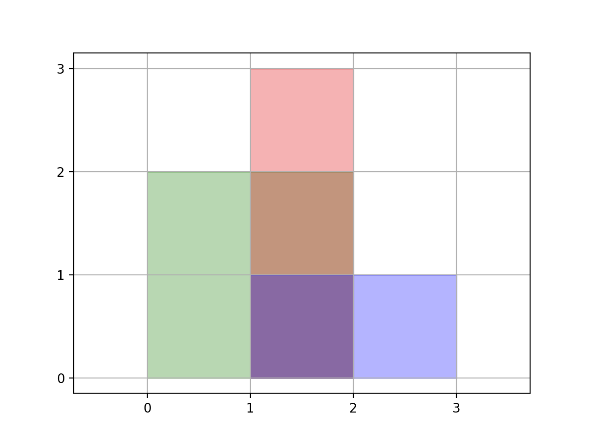

# 850 矩形面積 II

我們給出了一個（軸對齊的）二維矩形列表 rectangles 。 對於 rectangle[i] = [x1, y1, x2, y2]，其中（x1，y1）是矩形 i 左下角的坐標， (xi1, yi1) 是該矩形 左下角 的坐標， (xi2, yi2) 是該矩形 右上角 的坐標。

計算平面中所有 rectangles 所覆蓋的 總面積 。任何被兩個或多個矩形覆蓋的區域應只計算 一次 。

返回 總面積 。因為答案可能太大，返回 10<sup>9</sup> + 7 的 模 。

##  Rectangle Area II

You are given a 2D array of axis-aligned rectangles. Each rectangle[i] = [xi1, yi1, xi2, yi2] denotes the ith rectangle where (xi1, yi1) are the coordinates of the bottom-left corner, and (xi2, yi2) are the coordinates of the top-right corner.

Calculate the total area covered by all rectangles in the plane. Any area covered by two or more rectangles should only be counted once.

Return the total area. Since the answer may be too large, return it modulo 10<sup>9</sup> + 7.

[LeetCode](https://leetcode-cn.com/problems/rectangle-area-ii/)

### Example 1



```
Input: rectangles = [[0,0,2,2],[1,0,2,3],[1,0,3,1]]
Output: 6
Explanation: A total area of 6 is covered by all three rectangales, as illustrated in the picture.
From (1,1) to (2,2), the green and red rectangles overlap.
From (1,0) to (2,3), all three rectangles overlap.
```

### Example 2

```
Input: rectangles = [[0,0,1000000000,1000000000]]
Output: 49
Explanation: The answer is 1018 modulo (109 + 7), which is 49.
```

### Constraints

* 1 <= rectangles.length <= 200
* rectanges[i].length == 4
* 0 <= xi1, yi1, xi2, yi2 <= 10<sup>9</sup>


### C++ 

```
class Solution {
protected:
    typedef pair<pair<int,int>, pair<int,int>> iPair;
    const int MOD{1000000007};
      
    static bool cmp(const iPair& lhs, const iPair& rhs){
        return lhs.first.first < rhs.first.first;
    }
    
    int updateHeight(const multiset<pair<int,int>>& sections){
        int heighest = 0;
        int retLen = 0;
        for(const auto&[low, high] : sections){
            retLen += (max(heighest, high) - max(heighest, low));
            heighest = max(heighest, high);
        }

        return retLen;
    }

public:
    int rectangleArea(vector<vector<int>>& rectangles) {
        /*  類似天際線的概念，在每一個角進行添加/刪除 最高點及最低點的動作 */

        /*  將資料處理成對應的 x 點 */          
        vector<iPair> datas;
        for(const vector<int>& rectangle : rectangles){
            const int& low = rectangle[1];
            const int& high = rectangle[3];
            //添加我們用正值，刪除用負值
            datas.emplace_back(make_pair(rectangle[0], 1), make_pair(low, high));
            datas.emplace_back(make_pair(rectangle[2], -1), make_pair(low, high));
        }
        sort(datas.begin(), datas.end(), cmp);

        // 計算面積 更新正方形線段
        multiset<pair<int,int>> sections;  
        int prevPt = 0;
        int currHeight = 0;
        int retArea = 0;
        for(const iPair& data : datas){
            //先計算面積
            const int& currPt = data.first.first;
            int&& tempArea = static_cast<uint64_t>(currPt - prevPt) * currHeight % MOD;
            retArea = (retArea + tempArea) % MOD;
            if(data.first.second == 1) //添加或刪除正方形線段
                sections.insert(data.second);
            else
                sections.erase(sections.find(data.second));
            //求更新後的正方形高度總合
            currHeight = updateHeight(sections);
            prevPt = currPt;
        }
        

        return retArea;
    }
};
```
