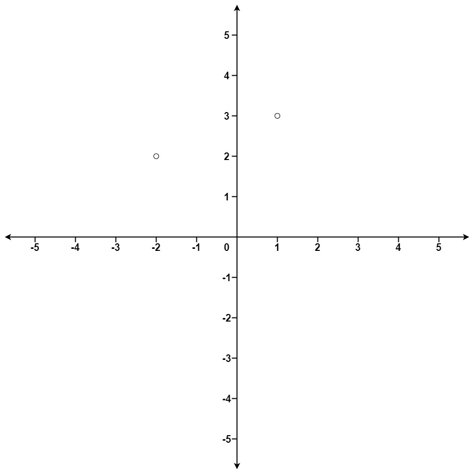

# 973 最接近原點的 K 個點

給定一個數組 points ，其中 points[i] = [xi, yi] 表示 X-Y 平面上的一個點，並且是一個整數 k ，返回離原點 (0,0) 最近的 k 個點。

這里，平面上兩點之間的距離是 歐幾里德距離（ √(x1 - x2)2 + (y1 - y2)2 ）。

你可以按 任何順序 返回答案。除了點坐標的順序之外，答案 確保 是 唯一 的。

##  K Closest Points to Origin

Given an array of points where points[i] = [xi, yi] represents a point on the X-Y plane and an integer k, return the k closest points to the origin (0, 0).

The distance between two points on the X-Y plane is the Euclidean distance (i.e., √(x1 - x2)2 + (y1 - y2)2).

You may return the answer in any order. The answer is guaranteed to be unique (except for the order that it is in).

[LeetCode](https://leetcode-cn.com/problems/k-closest-points-to-origin/)

### Example 1



```
Input: points = [[1,3],[-2,2]], k = 1
Output: [[-2,2]]
Explanation:
The distance between (1, 3) and the origin is sqrt(10).
The distance between (-2, 2) and the origin is sqrt(8).
Since sqrt(8) < sqrt(10), (-2, 2) is closer to the origin.
We only want the closest k = 1 points from the origin, so the answer is just [[-2,2]].
```

### Example 2

```
Input: points = [[3,3],[5,-1],[-2,4]], k = 2
Output: [[3,3],[-2,4]]
Explanation: The answer [[-2,4],[3,3]] would also be accepted.
```

### Constraints

* 1 <= k <= points.length <= 10<sup>4</sup>
* -10<sup>4</sup> < xi, yi < 10<sup>4</sup>

### C++ 

```
class Solution {
private:
    static bool cmp(const vector<int>& lhs, const vector<int>& rhs){
        int&& tempL = lhs[0] * lhs[0] + lhs[1] * lhs[1];
        int&& tempR = rhs[0] * rhs[0] + rhs[1] * rhs[1];
        if(tempL == tempR)
            return lhs[0] < rhs[0];

        return tempL < tempR;
    }
public:
    vector<vector<int>> kClosest(vector<vector<int>>& points, int k) {

        sort(points.begin(), points.end(), cmp);

        return vector<vector<int>>(points.begin(), points.begin() + k);
    }
};
```
