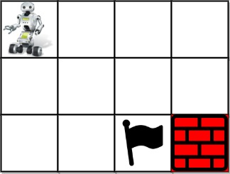

# 980 不同路径 III

在二維網格 grid 上，有 4 種類型的方格：

* 1 表示起始方格。且只有一個起始方格。
* 2 表示結束方格，且只有一個結束方格。
* 0 表示我們可以走過的空方格。
* -1 表示我們無法跨越的障礙。
返回在四個方向（上、下、左、右）上行走時，從起始方格到結束方格的不同路徑的數目。

每一個無障礙方格都要通過一次，但是一條路徑中不能重覆通過同一個方格。

##  Unique Paths III

You are given an m x n integer array grid where grid[i][j] could be:

* 1 representing the starting square. There is exactly one starting square.
* 2 representing the ending square. There is exactly one ending square.
* 0 representing empty squares we can walk over.
* -1 representing obstacles that we cannot walk over.
Return the number of 4-directional walks from the starting square to the ending square, that walk over every non-obstacle square exactly once.

[LeetCode](https://leetcode-cn.com/problems/unique-paths-iii/)

### Example 1



```
Input: grid = [[1,0,0,0],[0,0,0,0],[0,0,2,-1]]
Output: 2
Explanation: We have the following two paths: 
1. (0,0),(0,1),(0,2),(0,3),(1,3),(1,2),(1,1),(1,0),(2,0),(2,1),(2,2)
2. (0,0),(1,0),(2,0),(2,1),(1,1),(0,1),(0,2),(0,3),(1,3),(1,2),(2,2)
```

### Example 2


```
Input: grid = [[1,0,0,0],[0,0,0,0],[0,0,0,2]]
Output: 4
Explanation: We have the following four paths: 
1. (0,0),(0,1),(0,2),(0,3),(1,3),(1,2),(1,1),(1,0),(2,0),(2,1),(2,2),(2,3)
2. (0,0),(0,1),(1,1),(1,0),(2,0),(2,1),(2,2),(1,2),(0,2),(0,3),(1,3),(2,3)
3. (0,0),(1,0),(2,0),(2,1),(2,2),(1,2),(1,1),(0,1),(0,2),(0,3),(1,3),(2,3)
4. (0,0),(1,0),(2,0),(2,1),(1,1),(0,1),(0,2),(0,3),(1,3),(1,2),(2,2),(2,3)
```

### Constraints

* m == grid.length
* n == grid[i].length
* 1 <= m, n <= 20
* 1 <= m * n <= 20
* -1 <= grid[i][j] <= 2
* There is exactly one starting cell and one ending cell.

### C++ 

```
class Solution {
protected:
    int rowNum{0};
    int colNum{0};
    int target{0};
    int pathNum{0};
    int moves[4][2] = {{-1,0},{1,0},{0,-1},{0,1}};
    void dfs(const int& row, const int& col, const int& dir, vector<vector<int>>& grid, int& step){
        //目前位置標記為已走過
        grid[row][col] = -1;

        ++step;
        for(int i = 0; i < 4; ++i){
            int&& nextDir = (dir + i) % 4;
            int&& nextRow = row + moves[nextDir][0];
            int&& nextCol = col + moves[nextDir][1];

            if(nextRow < 0 || nextRow >= rowNum || nextCol < 0 || nextCol >= colNum || grid[nextRow][nextCol] == -1)
                continue;
            
            if(grid[nextRow][nextCol] == 2){
                if(step == target)
                    ++pathNum;
                continue;
            }

            //以下代表現在的點為未走過的空格                
            dfs(nextRow, nextCol, nextDir, grid, step);
        }
         --step;
        grid[row][col] = 0;
    }
public:
    int uniquePathsIII(vector<vector<int>>& grid) {
        /* dfs 計算總共需走多少步，當達到目標且步數符合代表找到一種走法 */
        rowNum = grid.size();
        colNum = grid[0].size();

        //找到起始點及計算有多少個空格
        int startRow = 0;
        int startCol = 0;
        for(int row = 0; row < rowNum; ++row){
            for(int col = 0; col < colNum; ++col){
                const int& curr = grid[row][col];
                if(curr == 1){
                    startRow = row;
                    startCol = col;
                }
                if(curr == 0)
                    ++target;
            }
        }
         ++target;

        int step = 0;
        int dir = 0;
        dfs(startRow, startCol, dir, grid, step);

        
        return pathNum;
    }
};
```
