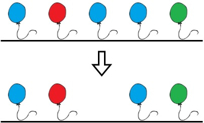

# 1578 使繩子變成彩色的最短時間

Alice 把 n 個氣球排列在一根繩子上。給你一個下標從 0 開始的字符串 colors ，其中 colors[i] 是第 i 個氣球的顏色。

Alice 想要把繩子裝扮成 彩色 ，且她不希望兩個連續的氣球塗著相同的顏色，所以她喊來 Bob 幫忙。Bob 可以從繩子上移除一些氣球使繩子變成 彩色 。
給你一個下標從 0 開始的整數數組 neededTime ，其中 neededTime[i] 是 Bob 從繩子上移除第 i 個氣球需要的時間（以秒為單位）。

返回 Bob 使繩子變成 彩色 需要的 最少時間 。

## Minimum Time to Make Rope Colorful

Alice 把 n 個氣球排列在一根繩子上。給你一個下標從 0 開始的字符串 colors ，其中 colors[i] 是第 i 個氣球的顏色。

Alice 想要把繩子裝扮成 彩色 ，且她不希望兩個連續的氣球塗著相同的顏色，所以她喊來 Bob 幫忙。Bob 可以從繩子上移除一些氣球使繩子變成 彩色 。
給你一個下標從 0 開始的整數數組 neededTime ，其中 neededTime[i] 是 Bob 從繩子上移除第 i 個氣球需要的時間（以秒為單位）。

返回 Bob 使繩子變成 彩色 需要的 最少時間 。

[LeetCode](https://leetcode.cn/problems/minimum-time-to-make-rope-colorful/)


### Example 1



```
Input: colors = "abaac", neededTime = [1,2,3,4,5]
Output: 3
Explanation: In the above image, 'a' is blue, 'b' is red, and 'c' is green.
Bob can remove the blue balloon at index 2. This takes 3 seconds.
There are no longer two consecutive balloons of the same color. Total time = 3.
```

### Example 2


```
Input: colors = "aabaa", neededTime = [1,2,3,4,1]
Output: 2
Explanation: Bob will remove the ballons at indices 0 and 4. Each ballon takes 1 second to remove.
There are no longer two consecutive balloons of the same color. Total time = 1 + 1 = 2.
```

### Constraints

* n == colors.length == neededTime.length
* 1 <= n <= 105
* 1 <= neededTime[i] <= 10<sup>4</sup>
* colors contains only lowercase English letters.

### C++ 

```

class Solution {
public:
    int minCost(string colors, vector<int>& neededTime) {
        /*
            相鄰的兩個汽球必定是不同顏色，採用滑動窗口，該窗口內只保留一個汽球
            該窗口內求合，並更新最大值，則cost為 合 減去 最大值
        */
        int left = 0;
        int tempMax = INT_MIN;
        int tempSum = 0;
        int ret = 0;

        for(int right = 0; right < colors.length(); ++right){

            if(colors[right] != colors[left]){
                left = right;
                ret += tempSum - tempMax;
                tempMax = INT_MIN;
                tempSum = 0;
            }      

            tempMax = max(tempMax, neededTime[right]);
            tempSum += neededTime[right];      
        }

        return ret + tempSum - tempMax;
    }
};
```
