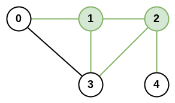

# 1615 最大網路鐵

n 座城市和一些連接這些城市的道路 roads 共同組成一個基礎設施網絡。每個 roads[i] = [ai, bi] 都表示在城市 ai 和 bi 之間有一條雙向道路。

兩座不同城市構成的 城市對 的 網絡秩 定義為：與這兩座城市 直接 相連的道路總數。如果存在一條道路直接連接這兩座城市，則這條道路只計算 一次 。

整個基礎設施網絡的 最大網絡秩 是所有不同城市對中的 最大網絡秩 。

給你整數 n 和數組 roads，返回整個基礎設施網絡的 最大網絡秩 。


## Maximal Network Rank

There is an infrastructure of n cities with some number of roads connecting these cities. Each roads[i] = [ai, bi] indicates that there is a bidirectional road between cities ai and bi.

The network rank of two different cities is defined as the total number of directly connected roads to either city. If a road is directly connected to both cities, it is only counted once.

The maximal network rank of the infrastructure is the maximum network rank of all pairs of different cities.

Given the integer n and the array roads, return the maximal network rank of the entire infrastructure.


[LeetCode](https://leetcode-cn.com/problems/maximal-network-rank/)

### Example 1


```
Input: n = 4, roads = [[0,1],[0,3],[1,2],[1,3]]
Output: 4
Explanation: The network rank of cities 0 and 1 is 4 as there are 4 roads that are connected to either 0 or 1. The road between 0 and 1 is only counted once.
```

### Example 2



```
Input: n = 5, roads = [[0,1],[0,3],[1,2],[1,3],[2,3],[2,4]]
Output: 5
Explanation: There are 5 roads that are connected to cities 1 or 2.
``` 

### Constraints

* 2 <= n <= 100
* 0 <= roads.length <= n * (n - 1) / 2
* roads[i].length == 2
* 0 <= ai, bi <= n-1
* a<sub>i</sub> != b<sub>i</sub>
* Each pair of cities has at most one road connecting them.


### C++ 

```
class Solution {
public:
    int maximalNetworkRank(int n, vector<vector<int>>& roads) {
        /*
            1. 分別統計每個城市的連接道路數量
            2. 紀錄哪些城市有第一多的路，以及第二多的道路
            3. 若第一多的城市只有一個，那就需要和第二多的的配對
            4. 若第一多的城市不只一個，那只需在第一多的間配對
            5. 配對的算法，若兩城市間有路相聯，則 相加後減一  若無則不用減
        */

        vector<vector<bool>> linkedCity(n, vector<bool>(n, false));
        vector<uint8_t> count(n, 0);

        //第一步，計算聯接到城市的數量
        for(auto& citys : roads){
            linkedCity[citys[0]][citys[1]] = true;
            linkedCity[citys[1]][citys[0]] = true;
            count[citys[0]]++;
            count[citys[1]]++;
        }

        //找出第一及第二多連接道路的城市
        int8_t first = -1;
        int8_t second = -1;
        for(const auto& num : count){
            if(first == -1 || first < num){
                second = first;
                first = num;
            }
            else if(second == -1 || second < num){
                second = num;
            }
        }

        // 哪些城市有第一多的道路，哪些城市有第二多的道路
        vector<uint8_t> maxSet;
        vector<uint8_t> secondSet;
        for(int i = 0; i < n; ++i){
            if(count[i] == first)
                maxSet.push_back(i);
            else if(count[i] == second)
                secondSet.push_back(i);
        }

        int ret = 0;
        //若第一多的城市不只一個
        int&& maxLen = maxSet.size();
        if(maxLen > 1){
            for(int i = 0; i < maxSet.size(); ++i){
                for(int j = i + 1; j < maxSet.size(); ++j){
                    int&& temp = count[maxSet[i]] + count[maxSet[j]];
                    if(linkedCity[maxSet[i]][maxSet[j]] == true)
                        temp--;
                    ret = max(ret, temp);
                }
            }
        }
        else{
            for(int i = 0; i < secondSet.size(); ++i){
                int&&temp = count[maxSet.front()] + count[secondSet[i]];
                if(linkedCity[maxSet.front()][secondSet[i]] == true)
                    temp--;
                ret = max(ret, temp);
            }
        }

        return ret;
    }
};
```
