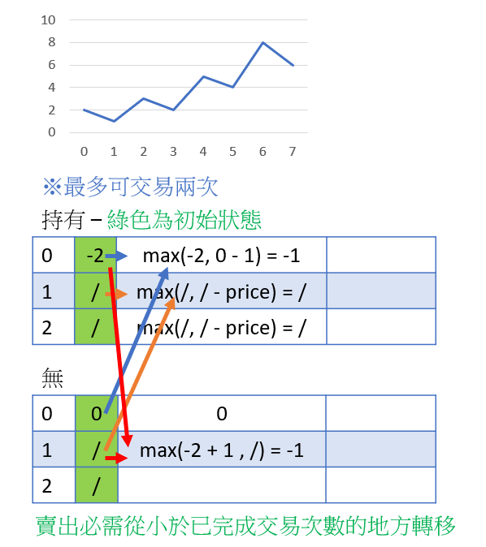

# 188 買賣股票的最佳時機IV

給定一個整數數組 prices ，它的第 i 個元素 prices[i] 是一支給定的股票在第 i 天的價格。

設計一個算法來計算你所能獲取的最大利潤。你最多可以完成 k 筆交易。

注意：你不能同時參與多筆交易（你必須在再次購買前出售掉之前的股票）。

##  Best Time to Buy and Sell Stock IV

You are given an integer array prices where prices[i] is the price of a given stock on the ith day, and an integer k.

Find the maximum profit you can achieve. You may complete at most k transactions.

Note: You may not engage in multiple transactions simultaneously (i.e., you must sell the stock before you buy again).

[LeetCode](https://leetcode.cn/problems/best-time-to-buy-and-sell-stock-iv/)


### Example 1

```
Input: k = 2, prices = [2,4,1]
Output: 2
Explanation: Buy on day 1 (price = 2) and sell on day 2 (price = 4), profit = 4-2 = 2.
```

### Example 2

```
Input: k = 2, prices = [3,2,6,5,0,3]
Output: 7
Explanation: Buy on day 2 (price = 2) and sell on day 3 (price = 6), profit = 6-2 = 4. Then buy on day 5 (price = 0) and sell on day 6 (price = 3), profit = 3-0 = 3.
```

### Constraints

* 1 <= k <= 100
* 1 <= prices.length <= 1000
* 0 <= prices[i] <= 1000


### C++ 



```

class Solution {
public:
    int maxProfit(int k, vector<int>& prices) {
        if (prices.size() == 0) 
            return 0;        
        
        //找出最大成交次數
        int&& len = prices.size();
        int limit = min(len >> 1 , k);

        vector<int> wiStock(limit + 1, -100000000);
        vector<int> noStock(limit + 1, -100000000);
        
        //初始化狀態
        wiStock[0] = -prices[0];
        noStock[0] = 0;

        for(int i = 1; i < len; ++i){
            wiStock[0] = max(wiStock[0], noStock[0] - prices[i]);

            for(int j = 1; j <= limit; ++j){
                wiStock[j] = max(wiStock[j], noStock[j] - prices[i]);
                noStock[j] = max(noStock[j], wiStock[j - 1] + prices[i]);
            }           
        }

         return *max_element(noStock.begin(), noStock.end());; 
        
    }
};
```
