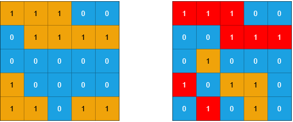
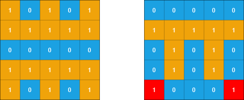

# 1905 統計子島嶼

給你兩個 m x n 的二進制矩陣 grid1 和 grid2 ，它們只包含 0 （表示水域）和 1 （表示陸地）。一個 島嶼 是由 四個方向 （水平或者豎直）上相鄰的 1 組成的區域。任何矩陣以外的區域都視為水域。

如果 grid2 的一個島嶼，被 grid1 的一個島嶼 完全 包含，也就是說 grid2 中該島嶼的每一個格子都被 grid1 中同一個島嶼完全包含，那麽我們稱 grid2 中的這個島嶼為 子島嶼 。

請你返回 grid2 中 子島嶼 的 數目 。


## Count Sub Islands

You are given two m x n binary matrices grid1 and grid2 containing only 0's (representing water) and 1's (representing land). An island is a group of 1's connected 4-directionally (horizontal or vertical). Any cells outside of the grid are considered water cells.

An island in grid2 is considered a sub-island if there is an island in grid1 that contains all the cells that make up this island in grid2.

Return the number of islands in grid2 that are considered sub-islands.

[LeetCode](https://leetcode-cn.com/problems/count-sub-islands/)

### Example 1



```
Input: grid1 = [[1,1,1,0,0],[0,1,1,1,1],[0,0,0,0,0],[1,0,0,0,0],[1,1,0,1,1]], grid2 = [[1,1,1,0,0],[0,0,1,1,1],[0,1,0,0,0],[1,0,1,1,0],[0,1,0,1,0]]
Output: 3
Explanation: In the picture above, the grid on the left is grid1 and the grid on the right is grid2.
The 1s colored red in grid2 are those considered to be part of a sub-island. There are three sub-islands.
```

### Example 2



```
Input: grid1 = [[1,0,1,0,1],[1,1,1,1,1],[0,0,0,0,0],[1,1,1,1,1],[1,0,1,0,1]], grid2 = [[0,0,0,0,0],[1,1,1,1,1],[0,1,0,1,0],[0,1,0,1,0],[1,0,0,0,1]]
Output: 2 
Explanation: In the picture above, the grid on the left is grid1 and the grid on the right is grid2.
The 1s colored red in grid2 are those considered to be part of a sub-island. There are two sub-islands.
``` 

### Constraints

* m == grid1.length == grid2.length
* n == grid1[i].length == grid2[i].length
* 1 <= m, n <= 500
* grid1[i][j] and grid2[i][j] are either 0 or 1.

### C++ 

```
class Solution {
public:
    int countSubIslands(vector<vector<int>>& grid1, vector<vector<int>>& grid2) {
        /*
            對grid2進行遍歷，當該處是陸地(1)
            放入隊列進行BFS，同時該位置變成0代表已經訪問過，如果在相對應的grid1中該位置為水 (0)
            這個島嶼非子島嶼，設立一個flag
        */
        int moves[4][2] = {{-1,0}, {1,0}, {0,-1}, {0,1}}; //上，下，左，右
        typedef pair<int,int> iPair;
        bool subIsland = true;
        queue<iPair> bfsQue;

        int&& numRow = grid2.size();
        int&& numCol = grid2[0].size();

        int ret = 0;

        for(int row = 0; row < numRow; ++row){
            for(int col = 0; col < numCol; ++col){
                if(grid2[row][col] == 0)
                    continue;

                subIsland = true;
                bfsQue.emplace(row, col);
                grid2[row][col] = 0;

                while(bfsQue.empty() != true){
                    iPair currPt = bfsQue.front();
                    bfsQue.pop();
                    if(grid1[currPt.first][currPt.second] == 0)
                        subIsland = false;

                    for(int i = 0; i < 4; ++i){
                        int&& nextRow = currPt.first + moves[i][0];
                        int&& nextCol = currPt.second + moves[i][1];
                        if(nextRow < 0 || nextRow >= numRow || nextCol < 0 || nextCol >= numCol || grid2[nextRow][nextCol] == 0)
                            continue;
                        
                        bfsQue.emplace(nextRow, nextCol);
                        grid2[nextRow][nextCol] = 0;
                    }
                }

                if(subIsland == true)
                    ++ret;               
            }
        }

        return ret;
    }
};
```
