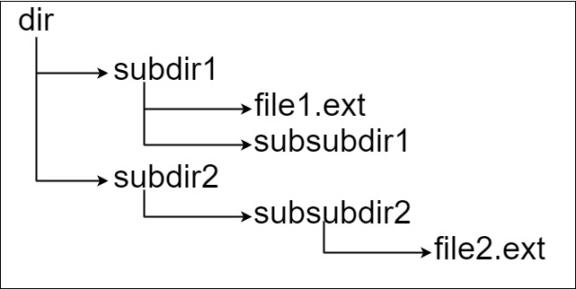

# 388 文件的最長絕對路徑

假設有一個同時存儲文件和目錄的文件系統。下圖展示了文件系統的一個示例：


這里將 dir 作為根目錄中的唯一目錄。dir 包含兩個子目錄 subdir1 和 subdir2 。subdir1 包含文件 file1.ext 和子目錄 subsubdir1；subdir2 包含子目錄 subsubdir2，該子目錄下包含文件 file2.ext 。

在文本格式中，如下所示(⟶表示制表符)：
```
dir
⟶ subdir1
⟶ ⟶ file1.ext
⟶ ⟶ subsubdir1
⟶ subdir2
⟶ ⟶ subsubdir2
⟶ ⟶ ⟶ file2.ext
```
如果是代碼表示，上面的文件系統可以寫為 `"dir\n\tsubdir1\n\t\tfile1.ext\n\t\tsubsubdir1\n\tsubdir2\n\t\tsubsubdir2\n\t\t\tfile2.ext"` 。`'\n'` 和 `'\t'` 分別是換行符和制表符。

文件系統中的每個文件和文件夾都有一個唯一的 絕對路徑 ，即必須打開才能到達文件/目錄所在位置的目錄順序，所有路徑用 '/' 連接。上面例子中，指向 `file2.ext` 的 絕對路徑 是 `"dir/subdir2/subsubdir2/file2.ext"` 。每個目錄名由字母、數字和/或空格組成，每個文件名遵循 name.extension 的格式，其中 name 和 extension由字母、數字和/或空格組成。

給定一個以上述格式表示文件系統的字符串 input ，返回文件系統中 指向 文件 的 最長絕對路徑 的長度 。 如果系統中沒有文件，返回 0。

##  Longest Absolute File Path


[LeetCode](https://leetcode.cn/problems//longest-absolute-file-path/)


### Example 1


```
Input: input = "dir\n\tsubdir1\n\tsubdir2\n\t\tfile.ext"
Output: 20
Explanation: We have only one file, and the absolute path is "dir/subdir2/file.ext" of length 20.
```

### Example 2



```
Input: input = "dir\n\tsubdir1\n\t\tfile1.ext\n\t\tsubsubdir1\n\tsubdir2\n\t\tsubsubdir2\n\t\t\tfile2.ext"
Output: 32
Explanation: We have two files:
"dir/subdir1/file1.ext" of length 21
"dir/subdir2/subsubdir2/file2.ext" of length 32.
We return 32 since it is the longest absolute path to a file.
```

### Constraints

* 1 <= input.length <= 10<sup>4</sup>
* input may contain lowercase or uppercase English letters, a new line character '\n', a tab character '\t', a dot '.', a space ' ', and digits.
* All file and directory names have positive length.


### C++ 

```
class Solution {
protected:
    int ret{0};
    vector<int> level{0};

    void checkLevel(const string& item){
        /*確認這個item是在第幾層*/
            int lvCount = 0;
            int lvSearch = 0;
            while((lvSearch = item.find('\t', lvSearch)) != string::npos){
                ++lvSearch;
                ++lvCount;
            }

            int&& textLen = item.length() - lvCount;
            if(item.find('.') != string::npos){
                //這是個檔案                
                ret = max(ret, level[lvCount] + textLen + lvCount);
            }
            else{
                if(level.size() == lvCount + 1)
                    level.push_back(textLen + level.back());
                else
                    level[lvCount + 1] = level[lvCount] + textLen;
            }
    }

public:
    int lengthLongestPath(string input) {
        /* 
            每一資料夾，檔案都會用 \n 隔開，除非是最後一個字
            開頭必會有 \t來表示其位於第幾層
        */
        int search = 0;
        int strStart = 0;
        
        while((search = input.find('\n', strStart)) != string::npos){
            const string item(input.begin() + strStart, input.begin() + search);            
            
            strStart = search + 1;  //下一個字符串的啟始位置

            checkLevel(item);
        }

        const string item(input.begin() + strStart, input.end());
        checkLevel(item);

        return ret;
    }
};
```
