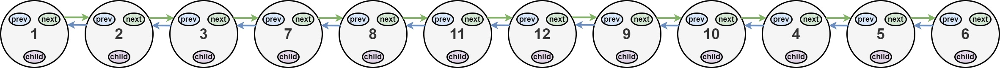
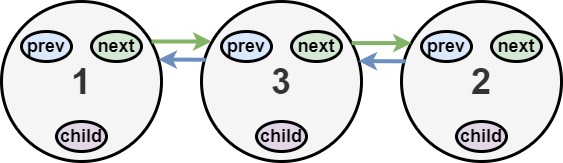

# 430 N叉樹的層序遍歷

給定一個 N 叉樹，返回其節點值的層序遍歷。（即從左到右，逐層遍歷）。

樹的序列化輸入是用層序遍歷，每組子節點都由 null 值分隔（參見示例）。


##  Flatten a Multilevel Doubly Linked List

You are given a doubly linked list, which contains nodes that have a next pointer, a previous pointer, and an additional child pointer. This child pointer may or may not point to a separate doubly linked list, also containing these special nodes. These child lists may have one or more children of their own, and so on, to produce a multilevel data structure as shown in the example below.

Given the head of the first level of the list, flatten the list so that all the nodes appear in a single-level, doubly linked list. Let curr be a node with a child list. The nodes in the child list should appear after curr and before curr.next in the flattened list.

Return the head of the flattened list. The nodes in the list must have all of their child pointers set to null.


[LeetCode](https://leetcode.cn/problems/flatten-a-multilevel-doubly-linked-list/)


### Example 1


```
Input: head = [1,2,3,4,5,6,null,null,null,7,8,9,10,null,null,11,12]
Output: [1,2,3,7,8,11,12,9,10,4,5,6]
Explanation: The multilevel linked list in the input is shown.
After flattening the multilevel linked list it becomes:
```




### Example 2


```
Input: head = [1,2,null,3]
Output: [1,3,2]
Explanation: The multilevel linked list in the input is shown.
After flattening the multilevel linked list it becomes:
```



### Constraints

* The number of Nodes will not exceed 1000.
* 1 <= Node.val <= 10<sup>5</sup>
 


### C++ 
```
/*
// Definition for a Node.
class Node {
public:
    int val;
    Node* prev;
    Node* next;
    Node* child;
};
*/

class Solution {
protected:
    Node* handle{nullptr};
    Node* tail{nullptr};
    
    void preOrder(Node* root){
        if(root == nullptr)
            return; 

        /*
            連接各Node
        */
        Node* next = root->next;
        Node* child = root->child;
        tail->next = root;
        root->prev = tail;
        root->child = nullptr;
        tail = root;
        
        preOrder(child);
        preOrder(next);
    }
public:
    Node* flatten(Node* head) {
        if(head == nullptr)
            return head;
        /*
            這其實就是二叉樹的前序遍歷
        */
        handle = new Node();
        handle->val = 0;
        handle->prev = nullptr;
        handle->next = nullptr;
        handle->child = nullptr;
        tail = handle;

        preOrder(head);

        Node* ret = handle->next;
        ret->prev = nullptr;
        delete handle;

        return ret;
        
    }
};
```
