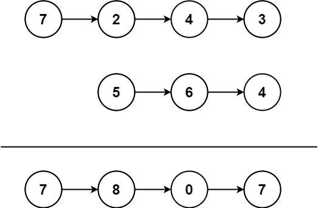

# 445 兩數相加 II

給你兩個 非空 鏈表來代表兩個非負整數。數字最高位位於鏈表開始位置。它們的每個節點只存儲一位數字。將這兩數相加會返回一個新的鏈表。

你可以假設除了數字 0 之外，這兩個數字都不會以零開頭。


##  String Compression

You are given two non-empty linked lists representing two non-negative integers. The most significant digit comes first and each of their nodes contains a single digit. Add the two numbers and return the sum as a linked list.

You may assume the two numbers do not contain any leading zero, except the number 0 itself.


[LeetCode](https://leetcode.cn/problems/add-two-numbers-ii/)


### Example 1




```
Input: l1 = [7,2,4,3], l2 = [5,6,4]
Output: [7,8,0,7]
```

### Example 2

```
Input: l1 = [2,4,3], l2 = [5,6,4]
Output: [8,0,7]
```


### Constraints

* The number of nodes in each linked list is in the range [1, 100].
* 0 <= Node.val <= 9
* It is guaranteed that the list represents a number that does not have leading zeros.


### C++ 
```
/**
 * Definition for singly-linked list.
 * struct ListNode {
 *     int val;
 *     ListNode *next;
 *     ListNode() : val(0), next(nullptr) {}
 *     ListNode(int x) : val(x), next(nullptr) {}
 *     ListNode(int x, ListNode *next) : val(x), next(next) {}
 * };
 */
class Solution {
public:
    ListNode* addTwoNumbers(ListNode* l1, ListNode* l2) {
        if(l1->val == 0 || l2->val == 0)
            return l1->val == 0? l2:l1;
        /* 使用兩個stack紀錄所有的node*/
        stack<ListNode*> nodeStk1;
        stack<ListNode*> nodeStk2;

        while(l1 != nullptr){
            nodeStk1.push(l1);
            l1 = l1->next;
        }

        while(l2 != nullptr){
            nodeStk2.push(l2);
            l2 = l2->next;
        }

        stack<ListNode*>& longStk = nodeStk1.size() >= nodeStk2.size()? nodeStk1 : nodeStk2;
        stack<ListNode*>& shortStk = nodeStk1.size() < nodeStk2.size()? nodeStk1 : nodeStk2;

        //當任一個棧中還有節點沒處理過
        int addNum = 0;
        ListNode* outputNode = nullptr;
        while(longStk.empty() != true || shortStk.empty() != true){
            outputNode = longStk.top();
            int num1 = outputNode->val;
            longStk.pop();

            int num2 = 0;
            if(shortStk.empty() != true){
                num2 = shortStk.top()->val;
                shortStk.pop();
            }

            int&& temp = num1 + num2 + addNum;
            outputNode->val = temp % 10;
            addNum = temp / 10;           
        }

        if(addNum != 0){
            ListNode* ret = new ListNode(addNum, outputNode);
            return ret;
        }

        return outputNode;
        
    }
};
```
