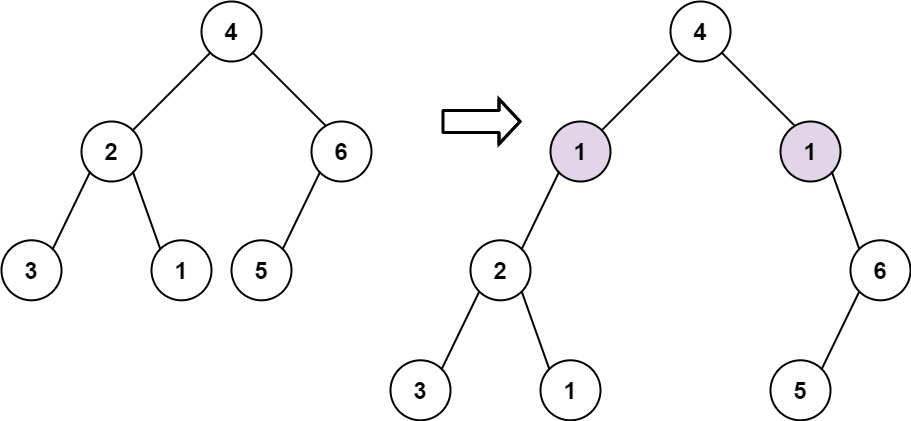

# 623  在二叉樹中增加一行

給定一個二叉樹的根 root 和兩個整數 val 和 depth ，在給定的深度 depth 處添加一個值為 val 的節點行。

注意，根節點 root 位於深度 1 。

加法規則如下:

* 給定整數 depth，對於深度為 depth - 1 的每個非空樹節點 cur ，創建兩個值為 val 的樹節點作為 cur 的左子樹根和右子樹根。
* cur 原來的左子樹應該是新的左子樹根的左子樹。
* cur 原來的右子樹應該是新的右子樹根的右子樹。
* 如果 depth == 1 意味著 depth - 1 根本沒有深度，那麼創建一個樹節點，值 val 作為整個原始樹的新根，而原始樹就是新根的左子樹。

##   Add One Row to Tree

Given the root of a binary tree and two integers val and depth, add a row of nodes with value val at the given depth depth.

Note that the root node is at depth 1.

The adding rule is:

* Given the integer depth, for each not null tree node cur at the depth depth - 1, create two tree nodes with value val as cur's left subtree root and right subtree root.
* cur's original left subtree should be the left subtree of the new left subtree root.
* cur's original right subtree should be the right subtree of the new right subtree root.
* If depth == 1 that means there is no depth depth - 1 at all, then create a tree node with value val as the new root of the whole original tree, and the original tree is the new root's left subtree.

[LeetCode](https://leetcode.cn/problems/add-one-row-to-tree/)


### Example 1



```
Input: root = [4,2,6,3,1,5], val = 1, depth = 2
Output: [4,1,1,2,null,null,6,3,1,5]
```


### Example 2


```
Input: root = [4,2,null,3,1], val = 1, depth = 3
Output: [4,2,null,1,1,3,null,null,1]
```

### Constraints

* The number of nodes in the tree is in the range [1, 10<sup>4</sup>].
* The depth of the tree is in the range [1, 10<sup>4</sup>].
* -100 <= Node.val <= 100
* -10<sup>5</sup> <= val <= 10<sup>5</sup>
* 1 <= depth <= the depth of tree + 1


### C++ 
```
/**
 * Definition for a binary tree node.
 * struct TreeNode {
 *     int val;
 *     TreeNode *left;
 *     TreeNode *right;
 *     TreeNode() : val(0), left(nullptr), right(nullptr) {}
 *     TreeNode(int x) : val(x), left(nullptr), right(nullptr) {}
 *     TreeNode(int x, TreeNode *left, TreeNode *right) : val(x), left(left), right(right) {}
 * };
 */
class Solution
{
protected:
    enum branch
    {
        left,
        right
    };

    void preOrder(TreeNode *&root, const int& val, const int& depth, const branch& fromBranch, const int& tarDep){

        if(root == nullptr){
            if(depth == tarDep)
                root =  new TreeNode(val);
            return;
        }
        else if(depth == tarDep){
            TreeNode* insertNode = new TreeNode(val);
            if(fromBranch == left)
                insertNode->left = root;
            else
                insertNode->right = root;
            root = insertNode;
            return;
        }

        preOrder(root->left, val, depth + 1, left, tarDep);
        preOrder(root->right, val, depth + 1, right, tarDep);

    }
public:
    TreeNode *addOneRow(TreeNode *root, int val, int depth)
    {
        if (depth == 1){
            TreeNode* ret = new TreeNode(val);
            ret->left = root;
            return ret;
        }

        preOrder(root, val, 1, left, depth);

        return root;
    }
};
```
