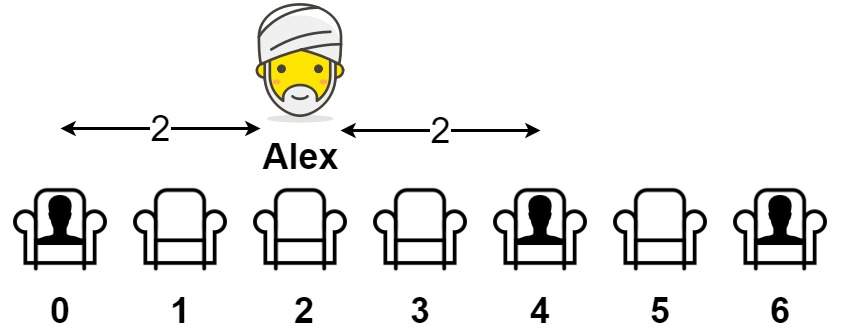

# 849 到最近的人的最大距離

給你一個數組 seats 表示一排座位，其中 seats[i] = 1 代表有人坐在第 i 個座位上，seats[i] = 0 代表座位 i 上是空的（下標從 0 開始）。

至少有一個空座位，且至少有一人已經坐在座位上。

亞歷克斯希望坐在一個能夠使他與離他最近的人之間的距離達到最大化的座位上。

返回他到離他最近的人的最大距離。 

##  Maximize Distance to Closest Person

You are given an array representing a row of seats where seats[i] = 1 represents a person sitting in the ith seat, and seats[i] = 0 represents that the ith seat is empty (0-indexed).

There is at least one empty seat, and at least one person sitting.

Alex wants to sit in the seat such that the distance between him and the closest person to him is maximized. 

Return that maximum distance to the closest person.
 
[LeetCode](https://leetcode.cn/problems/maximize-distance-to-closest-person/)


### Example 1



```
Input: seats = [1,0,0,0,1,0,1]
Output: 2
Explanation: 
If Alex sits in the second open seat (i.e. seats[2]), then the closest person has distance 2.
If Alex sits in any other open seat, the closest person has distance 1.
Thus, the maximum distance to the closest person is 2.
```

### Example 2

```
Input: seats = [1,0,0,0]
Output: 3
Explanation: 
If Alex sits in the last seat (i.e. seats[3]), the closest person is 3 seats away.
This is the maximum distance possible, so the answer is 3.
```


### Constraints

* 2 <= seats.length <= 2 * 10<sup>4</sup>
* seats[i] is 0 or 1.
* At least one seat is empty.
* At least one seat is occupied.


### C++ 
```
class Solution {
public:
    int maxDistToClosest(vector<int>& seats) {
        /*
            需特別考慮開始及結尾的計算條件，其餘的部份就只要計算
            兩邊都有人坐的，而中間都沒人，若長度為奇數，則距離/2，若為偶數 則距離 / 2 - 1
        */
        int retDist = INT_MIN;
        for(int i = 0, start = 0; i < seats.size(); ++i){
            if(seats[i] == 1){
                if(seats[start] == 0)
                    retDist = max(retDist, i - start);
                else
                    retDist = max(retDist, (i - start) >> 1);
                start = i;
            }
            else if(i == seats.size() - 1){
                retDist = max(retDist, i - start);
            }            
        }

        return retDist;
    }
};
```
