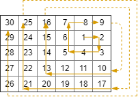

# 885 螺旋矩陣 III

在 rows x cols 的網格上，你從單元格 (rStart, cStart) 面朝東面開始。網格的西北角位於第一行第一列，網格的東南角位於最後一行最後一列。

你需要以順時針按螺旋狀行走，訪問此網格中的每個位置。每當移動到網格的邊界之外時，需要繼續在網格之外行走（但稍後可能會返回到網格邊界）。

最終，我們到過網格的所有 rows x cols 個空間。

按照訪問順序返回表示網格位置的坐標列表。

##   Spiral Matrix III

You start at the cell (rStart, cStart) of an rows x cols grid facing east. The northwest corner is at the first row and column in the grid, and the southeast corner is at the last row and column.

You will walk in a clockwise spiral shape to visit every position in this grid. Whenever you move outside the grid's boundary, we continue our walk outside the grid (but may return to the grid boundary later.). Eventually, we reach all rows * cols spaces of the grid.

Return an array of coordinates representing the positions of the grid in the order you visited them.

 
[LeetCode](https://leetcode.cn/problems/spiral-matrix-iii/)


### Example 1


```
Input: rows = 1, cols = 4, rStart = 0, cStart = 0
Output: [[0,0],[0,1],[0,2],[0,3]]
```

### Example 2



```
Input: rows = 5, cols = 6, rStart = 1, cStart = 4
Output: [[1,4],[1,5],[2,5],[2,4],[2,3],[1,3],[0,3],[0,4],[0,5],[3,5],[3,4],[3,3],[3,2],[2,2],[1,2],[0,2],[4,5],[4,4],[4,3],[4,2],[4,1],[3,1],[2,1],[1,1],[0,1],[4,0],[3,0],[2,0],[1,0],[0,0]]
```


### Constraints

* 1 <= rows, cols <= 100
* 0 <= rStart < rows
* 0 <= cStart < cols


### C++ 
```
class Solution {
protected:
    const int moves[4][2] = {{0,1},{1,0},{0,-1},{-1,0}};
    const int times [4] = {0,0,1,1};
    uint8_t core{1};
public:
    vector<vector<int>> spiralMatrixIII(int rows, int cols, int rStart, int cStart) {
        vector<vector<int>> ret;
        ret.push_back(vector<int>{rStart,cStart});
        int&& target = rows * cols - 1; //start點依題意可直接加入，扣除1

        while(target > 0){

            for(int i = 0; i < 4; ++i){
                int&& limit = times[i] + core;
                for(int j = 0; j < limit; ++j){
                    rStart += moves[i][0];
                    cStart += moves[i][1];
                    if(rStart >= 0 && rStart < rows && cStart >= 0 && cStart < cols){
                        ret.push_back(vector<int>{rStart,cStart});
                        if(--target == 0)
                            return ret;
                    }
                }
            }
            core += 2;
        }

        return ret;
    }
};
```
