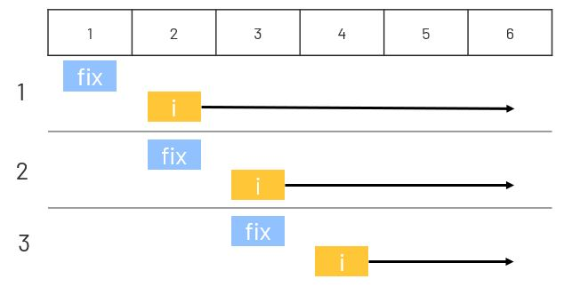

# 001. Two Sum
Given an array of integers nums and an integer target, return indices of the two numbers such that they add up to target.  
You may assume that each input would have exactly one solution, and you may not use the same element twice.  
You can return the answer in any order.  

# 兩數之和
給定一個整數數組 nums 和一個目標值 target，請你在該數組中找出和為目標值的那 兩個 整數，並返回他們的數組下標。  
你可以假設每種輸入只會對應一個答案。但是，數組中同一個元素不能使用兩遍。

[LeetCode](https://leetcode.com/problems/two-sum/) 

### Example 1:
```
Input: nums = [2,7,11,15], target = 9
Output: [0,1]
Output: Because nums[0] + nums[1] == 9, we return [0, 1].
```


## Solution

### C++

* 空間複雜度 O(n)  遍曆一次 list

* 時間複雜度 O(n)  最差的情況下會儲存整個list
```
#include <vector>
#include <unordered_map>

using namespace std;

class Solution
{
public:
    vector<int> twoSum(vector<int> &nums, int target)
    {

        int len = nums.size();
        unordered_map<int, int> valueIdMap;

        for (int i = 0; i < len; ++i)
        {            
            if( valueIdMap.find(target - nums[i]) != valueIdMap.end())
                return vector<int>{i, valueIdMap[target - nums[i]]};

            valueIdMap[nums[i]] = i;
        }

        return vector<int>{-1,-1};
    }
};

int main()
{
    /* Input*/
    vector<int> input = {2, 7, 11, 15};

    /* unit test*/
    Solution test;
    vector<int> res = test.twoSum(input, 9);

    return 0;
}
```

### C
* Brute Force
  

```
int* twoSum(int* nums, int numsSize, int target, int* returnSize){
    *returnSize = 0;
    int *return_array = (int *)malloc(2 * sizeof(int));

    for (int i = 0; i < numsSize; ++i){
        int search = target - nums[i];

        for (int j = i + 1; j < numsSize; ++j){
            
            if (nums[j] == search){
                return_array[0] = i;
                return_array[1] = j;
                *returnSize = 2;

                return return_array;
            }
        }
    }
    return return_array;
}

```


