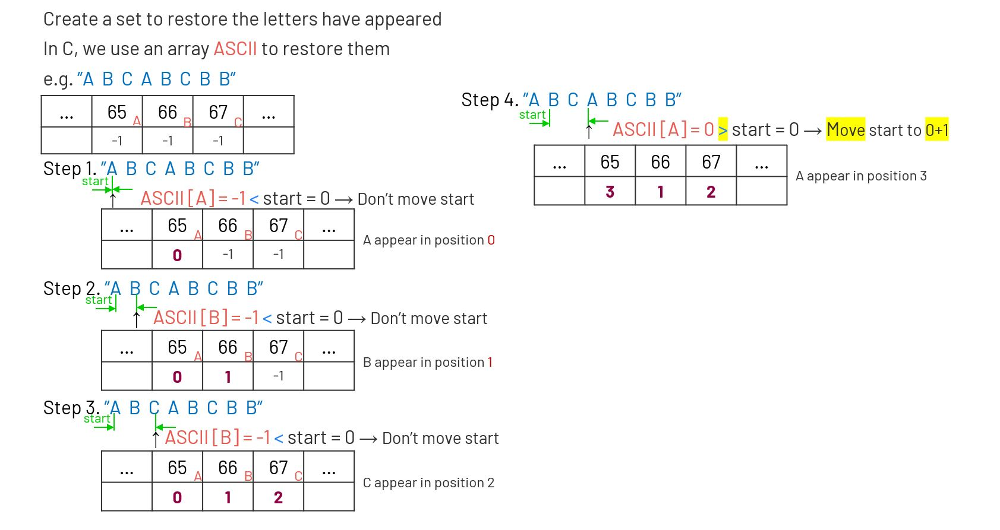

# 003. Longest Substring Without Repeating Characters
Given a string s, find the length of the longest substring without repeating characters.

[LeetCode](https://leetcode.com/problems/longest-substring-without-repeating-characters/)

### Example 1:
```
Input: s = "abcabcbb"
Output: 3
```
### Example 2:
```
Input: s = "bbbbb"
Output: 1
Explanation: The answer is "b", with the length of 1.
```
### Example 3:
```
Input: s = "pwwkew"
Output: 3
Explanation: The answer is "wke", with the length of 3.
Notice that the answer must be a substring, "pwke" is a subsequence and not a substring.
```
### Example 4:
```
Input: s = ""
Output: 0
```

#  無重覆字符的最長子串
給定一個字符串，請你找出其中不含有重覆字符的最長子串的長度

## Solution  


### C

```
int lengthOfLongestSubstring(char *s)
{
    int ascii[128];
    memset(ascii, -1, sizeof(ascii));

    int start = 0;
    int max_len = 0;
    int len = strlen(s);

    for (int i = 0; i < len; i++)
    {
        int tmp = ascii[s[i]];
        if (ascii[s[i]] >= start)
        {
            start = ascii[s[i]] + 1;
        }
        ascii[s[i]] = i;
        if ((i - start + 1) > max_len)
            max_len = (i - start + 1);
    }

    return max_len;
}
```


