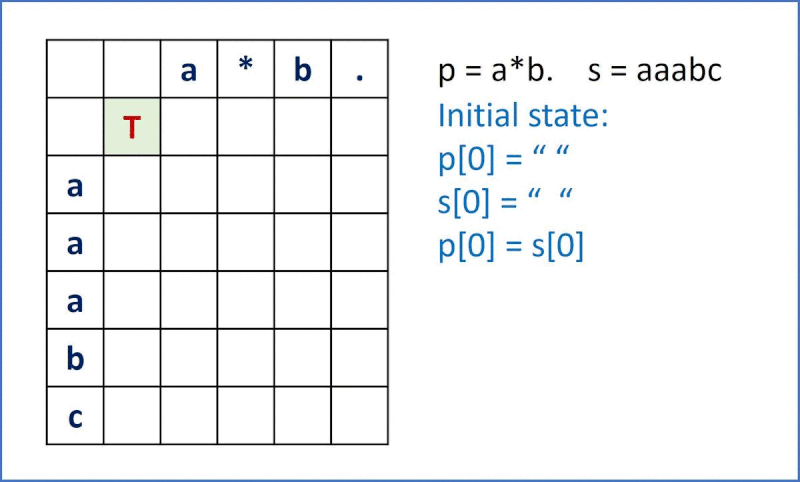

# 010. Regular Expression Matching
Given an input string (s) and a pattern (p), implement regular expression matching with support for '.' and '*' where: 

* '.' Matches any single character.​​​​
* '*' Matches zero or more of the preceding element.
* The matching should cover the entire input string (not partial)

[LeetCode](https://leetcode.com/problems/regular-expression-matching)

### Example 1:
```
Input: s = "aa", p = "a"
Output: false
Explanation: "a" does not match the entire string "aa".
```

### Example 2:
```
Input: s = "aa", p = "a*"
Output: true
Explanation: '*' means zero or more of the preceding element, 'a'. Therefore, by repeating 'a' once, it becomes "aa".
```

### Example 3:
```
Input: s = "ab", p = ".*"
Output: true
Explanation: ".*" means "zero or more (*) of any character (.)".
```

# 010. 正則表達式匹配

給你一個字符串 s 和一個字符規律 p，請你來實現一個支持 '.' 和 '*' 的正則表達式匹配。

* '.' 匹配任意單個字符
* '*' 匹配零個或多個前面的那一個元素
所謂匹配，是要涵蓋 整個 字符串 s的，而不是部分字符串。


## Solution  
* Dynammic Programming



### C++

```
#include <string>
#include <vector>

using namespace std;

class Solution
{
public:
    bool isMatch(string s, string p)
    {
        /* for special cases*/
        if ((s == "") && (p == ""))
            return true;
        else if ((s != "") && (p == ""))
            return false;

        /* create dynamic programming space*/
        int sLen = s.size();
        int pLen = p.size();
        vector<vector<bool>> dp(sLen + 1, vector<bool>(pLen + 1, false));

        /* initialize dp space*/
        dp[0][0] = true;
        for (int i = 1; i <= pLen; ++i)
        {
            /* * could only appear on i >= 2, so i-2 always >= 0 */
            if (p[i - 1] == '*')
                dp[0][i] = dp[0][i - 2];
        }

        /* dynammic programming*/
        for (int row = 1; row <= sLen; ++row)
        {
            for (int col = 1; col <= pLen; ++col)
            {
                if (p[col - 1] != '*')
                {
                    if ((s[row - 1] == p[col - 1]) || (p[col - 1] == '.'))
                        dp[row][col] = dp[row - 1][col - 1];
                }
                else
                {
                    if (dp[row][col - 2] == true)
                        dp[row][col] = true;
                    else if ((s[row - 1] == p[col - 2]) || (p[col - 2] == '.')) 
                        dp[row][col] = dp[row - 1][col];
                }
            }
        }        

        return dp[sLen][pLen];
    }
};

int main()
{
    string input1 = "aaabcaab";
    string input2 = "a*b.a*b";

    Solution test;
    bool res = test.isMatch(input1, input2);

    return 0;
}
```