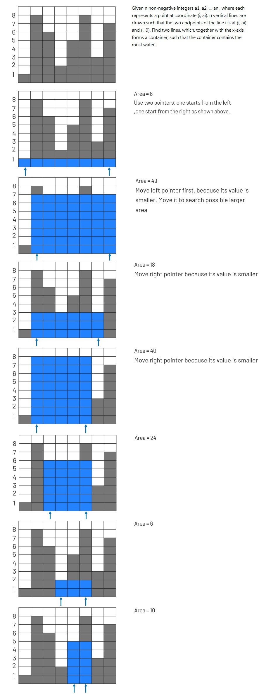

# 011. Container With Most Water
Given n non-negative integers a1, a2, ..., an , where each represents a point at coordinate (i, ai). n vertical lines are drawn such that the two endpoints of the line i is at (i, ai) and (i, 0). Find two lines, which, together with the x-axis forms a container, such that the container contains the most water.


### NOTE: 
Notice that you may not slant the container.

[LeetCode](https://leetcode.com/problems/container-with-most-water)

### Example 1:
```
Input: height = [1,8,6,2,5,4,8,3,7]
Output: 49
Explanation: The above vertical lines are represented by array [1,8,6,2,5,4,8,3,7]. In this case, the max area of water (blue section) the container can contain is 49.
```
### Example 2:
```
Input: height = [1,1]
Output: 1
```
### Example 3:
```
Input: height = [4,3,2,1,4]
Output: 16
```
### Example 4:
```
Input: height = [1,2,1]
Output: 2
```

#  盛最多水的容器
給你 n 個非負整數 a1，a2，...，an，每個數代表坐標中的一個點 (i, ai) 。在坐標內畫 n 條垂直線，垂直線 i 的兩個端點分別為 (i, ai) 和 (i, 0) 。找出其中的兩條線，使得它們與 x 軸共同構成的容器可以容納最多的水。


## Solution  


### C

```
#define MIN(x, y) (x < y ? x : y)

int maxArea(int *height, int heightSize)
{
    int left = 0;
    int right = heightSize - 1;
    int tmp_area= 0;
    int max_area = 0;

    while (left < right)
    {
        tmp_area = MIN(height[left], height[right]) * (right - left);
        max_area = tmp_area > max_area ? tmp_area : max_area;
        if (height[left] < height[right])
            left++;
        else
            right--;
    }

    return max_area;
}
```


