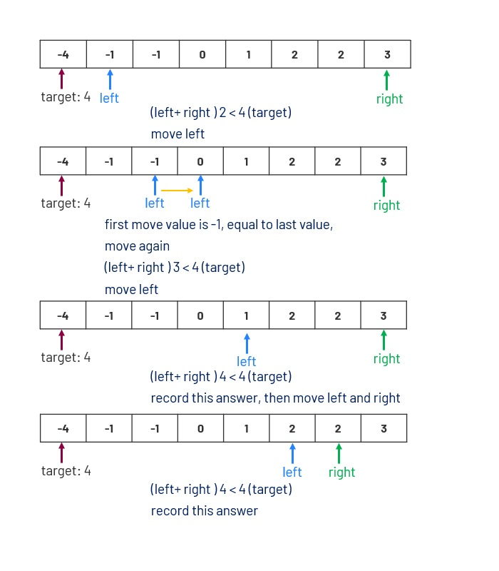

# 015 3Sum
Given an array nums of n integers, are there elements a, b, c in nums such that a + b + c = 0? Find all unique triplets in the array which gives the sum of zero.

Notice that the solution set must not contain duplicate triplets.

##  三數之合
給你一個包含 n 個整數的數組 nums，判斷 nums 中是否存在三個元素 a，b，c ，使得 a + b + c = 0 ？請你找出所有和為 0 且不重覆的三元組。

注意：答案中不可以包含重覆的三元組。

### NOTE: 
Notice that you may not slant the container.

[LeetCode](hhttps://leetcode.com/problems/3sum/)

### Example 1:
```
Input: nums = [-1,0,1,2,-1,-4]
Output: [[-1,-1,2],[-1,0,1]]
```
### Example 2:
```
Input: nums = []
Output: []
```
### Example 3:
```
Input: nums = [0]
Output: []
```


## Solution  


###C++

```
#include <vector>
#include <algorithm>

using namespace std;

class Solution
{
public:
  vector<vector<int>> threeSum(vector<int> &nums)
  {
    vector<vector<int>> ret;

    int len = nums.size();
    if (len < 3)
      return ret;

    sort(nums.begin(), nums.end());

    /* find three elements , sum = 0
      each time target one most left element, 
      find the rest two element by adding it from both ends*/

    int left = 0;
    int right = 0;
    int target = 0;
    for (int i = 0; i < len - 2; ++i)
    {
      if (nums[i] > 0)
        break;
      else if (i > 0 && nums[i] == nums[i - 1])
        continue;

      target = abs(nums[i]);
      left = i + 1;
      right = len - 1;

      while (left < right)
      {
        if (nums[left] + nums[right] < target)
          left++;
        else if (nums[left] + nums[right] > target)
          right--;
        else
        {
          ret.emplace_back(vector<int>{nums[i], nums[left], nums[right]});
          while (left < right && nums[left] == nums[++left]);
          while (left < right && nums[right] == nums[--right]);
        }
      }
    }
    return ret;
  }
};

int main()
{
  vector<int> input{-2, 0, 0, 2, 2};
  Solution test;

  vector<vector<int>> res = test.threeSum(input);

  return 0;
}
```

### C

```
int comp(const void *a, const void *b)
{
    return (*(int *)a - *(int *)b);
}

int **threeSum(int *nums, int numsSize, int *returnSize, int **returnColumnSizes)
{
    *returnSize = 0;
    if (nums == NULL || numsSize < 3)
        return NULL;
    /* sort array in ascending order */
    qsort(nums, numsSize, sizeof(int), comp);

    /* declare two pointers' */
    int left = 0;
    int right = 0;
    int target = 0;

    /* allocate space to store result*/
    int **ret = (int **)malloc(sizeof(int *) * ((numsSize-1)*(numsSize-2)/2));
    *returnColumnSizes = (int *)malloc(sizeof(int) * ((numsSize-1)*(numsSize-2)/2));

    for (int i = 0; i < numsSize - 2; ++i)
    {
        if (nums[i] > 0)
            break;
        else if (i >= 1 && nums[i] == nums[i - 1])
            continue;

        target = 0 - nums[i];
        left = i + 1;
        right = numsSize - 1;
        while (left < right)
        {
            int left_value = nums[left];
            int right_value = nums[right];
            if (nums[left] + nums[right] > target)
            {
                --right;
                while (nums[right] == nums[right + 1] && right > left)
                    --right;
            }
            else if (nums[left] + nums[right] < target)
            {
                ++left;
                while (nums[left] == nums[left - 1] && left < right)
                    ++left;
            }
            else
            {
                (*returnColumnSizes)[*returnSize] = 3;
                ret[*returnSize] = (int *)malloc(sizeof(int) * 3);
                ret[*returnSize][0] = nums[i];
                ret[*returnSize][1] = nums[left];
                ret[*returnSize][2] = nums[right];
                while (nums[left] == nums[++left] && left < right){}
                while (nums[right] == nums[--right] && left < right){}
                ++(*returnSize);
            }
        }
    }
    return ret;
}
```


