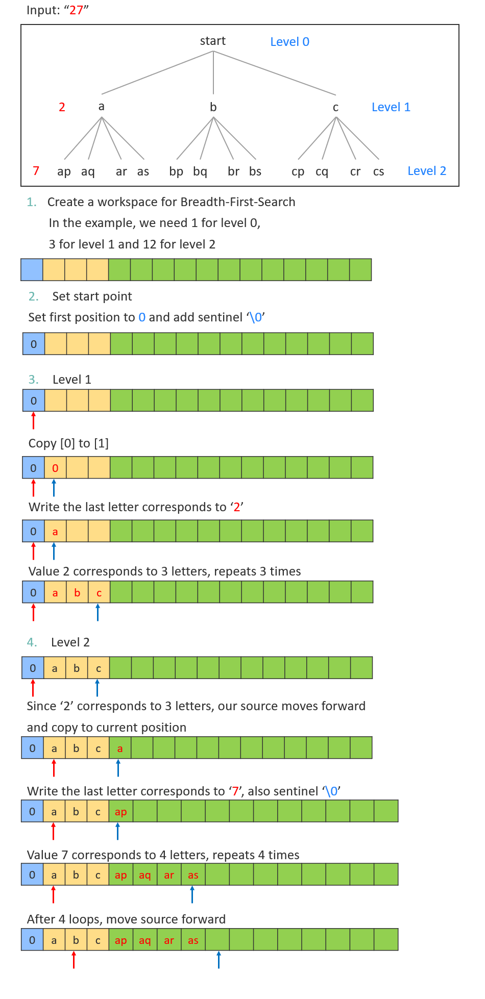

# 017 Letter Combinations of a Phone Number
Given a string containing digits from 2-9 inclusive, return all possible letter combinations that the number could represent. Return the answer in any order.

A mapping of digit to letters (just like on the telephone buttons) is given below. Note that 1 does not map to any letters.


[LeetCode](https://leetcode.com/problems/letter-combinations-of-a-phone-number/)

### Example 1:
```
Input: digits = "23"
Output: ["ad","ae","af","bd","be","bf","cd","ce","cf"]
```
### Example 2:
```
Input: digits = ""
Output: []
```
### Example 3:
```
Input: digits = "2"
Output: ["a","b","c"]
```


#  電話號碼的字母組合
給定一個僅包含數字 2-9 的字符串，返回所有它能表示的字母組合。

給出數字到字母的映射如下（與電話按鍵相同）。注意 1 不對應任何字母


## Solution  
### Breadth First Search



## C

```
int totalBfsSpace(char *digits, int stringLength, int *digitLen)
{
    int currentLen = 1;
    int factor = 3;
    int totalLen = 0;
    for (int i = 0; i < stringLength; ++i)
    {
        if (digits[i] == '7' || digits[i] == '9')
            factor = 4;
        else
            factor = 3;
        currentLen *= factor;
        totalLen += currentLen;
    }

    return totalLen;
}

char **letterCombinations(char *digits, int *returnSize)
{
    int len = strlen(digits);
    if (len == 0)
    {
        *returnSize = 0;
        return NULL;
    }

    int digitLen[8] = {97, 100, 103, 106, 109, 112, 116, 119};
    int bfs_space = totalBfsSpace(digits, len, digitLen);

    /* create a 2D array pointer to restore pointer of each row*/
    char **array = (char **)malloc(sizeof(char *) * (bfs_space + 1));

    /* set the starting point*/
    array[0] = (char *)malloc(sizeof(char) * 2);
    array[0][0] = '0';
    array[0][1] = '\0';

    unsigned level = 1U;
    unsigned srcIndex = 0U;
    unsigned counter = 0U;
    unsigned factor = 3;

    if (digits[level - 1U] == '7' || digits[level - 1U] == '9')
        factor = 4;

    unsigned levelLength = factor;
    int totalLen = levelLength;
    *returnSize = factor;

    for (int i = 1; i <= bfs_space; ++i)
    {
        array[i] = (char *)malloc(sizeof(char) * (level + 1));
        strcpy(array[i], array[srcIndex]);
        array[i][level - 1U] = digitLen[digits[level - 1U] - 50] + counter;
        array[i][level] = '\0';
        ++counter;

        if (counter >= factor)
        {
            counter = 0U;
            ++srcIndex;
        }
        if (i >= totalLen)
        {
            ++level;
            if (level <= len)
            {
                if (digits[level - 1U] == '7' || digits[level - 1U] == '9')
                    factor = 4U;
                else
                    factor = 3U;
                levelLength = levelLength * factor;
                totalLen = totalLen + levelLength;
                *returnSize = levelLength;
            }
        }
    }

    return array + (bfs_space + 1 - *returnSize);
}
```


