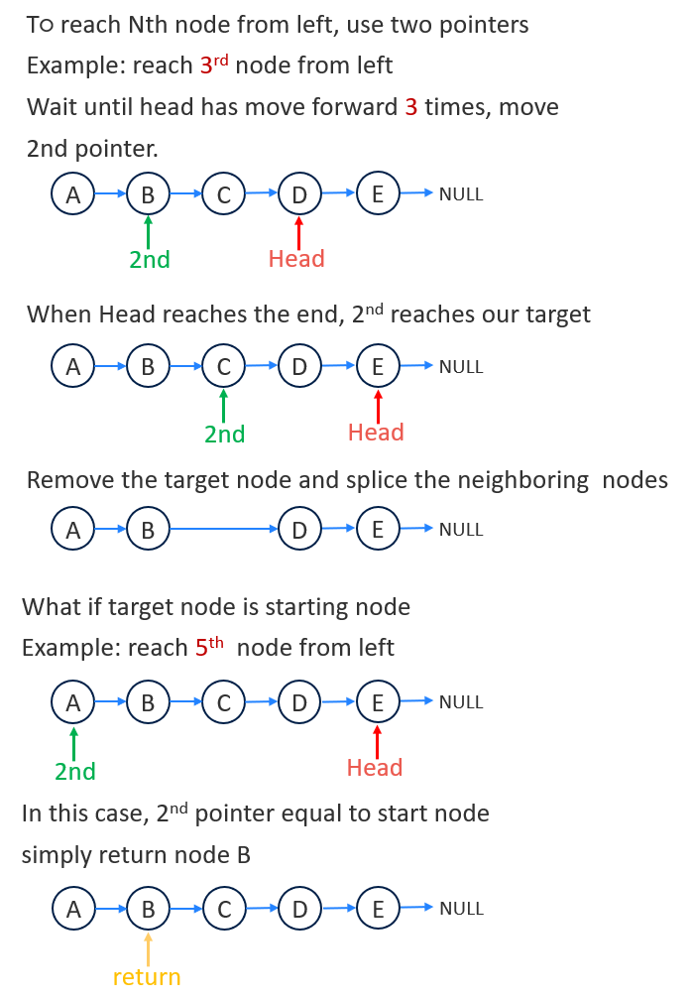

# 019. Remove Nth Node From End of List
Given the head of a linked list, remove the nth node from the end of the list and return its head.

Follow up: Could you do this in one pass?

[LeetCode](https://leetcode.com/problems/remove-nth-node-from-end-of-list/)  

### Example 1:

```
Input: head = [1,2,3,4,5], n = 2
Output: [1,2,3,5]
```

### Example 2:
```
Input: head = [1], n = 1
Output: []
```

### Example 3:
```
Input: head = [1,2], n = 1
Output: [1]
```

#  刪除鏈表的倒數第 N 個結點
給你一個鏈表，刪除鏈表的倒數第 n 個結點，並且返回鏈表的頭結點。

進階：你能嘗試使用一趟掃描實現嗎？  

## Solution
* Multiple pointers



### C

```
struct ListNode *removeNthFromEnd(struct ListNode *head, int n)
{
    if (head->next == NULL)
        return NULL;

    struct ListNode *record = head;
    struct ListNode *NthNode = head;
    struct ListNode *NthMinusOne = head;

    unsigned counter = 1U;

    /* pointers start at different time to reach target posiiton */
    while (head->next != NULL)
    {
        head = head->next;
        if (counter >= n)
        {
            NthMinusOne = NthNode;
            NthNode = NthNode->next;
        }
        ++counter;
    }

    /* NthNode is at target posiyion remove target Node */

    /* NthNode equal to record means we want to remove first node */
    if (NthNode == record)
        return NthNode->next;
    else
        NthMinusOne->next = NthNode->next;

    return record;
}
```
