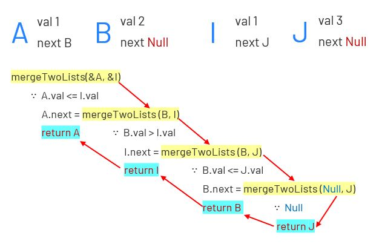

# 021. Merge Two Sorted Lists
Merge two sorted linked lists and return it as a new sorted list. The new list should be made by splicing together the nodes of the first two lists.
[LeetCode](https://leetcode.com/problems/merge-two-sorted-lists/)  

### Example 1:
```
Input: l1 = [1,2,4], l2 = [1,3,4]
Output: [1,1,2,3,4,4]
```
### Example 2:
```
Input: l1 = [], l2 = []
Output: []
```
# 合併兩個有序鍊表  
將兩個有序鍊表合併為一個新的升序鍊表並反回  
新鍊表是通過拼接給定的兩個鍊表的所有節點組成的  

# Solution


## C

```
struct ListNode* mergeTwoLists(struct ListNode* l1, struct ListNode* l2){
    if (l1 == NULL || l2 == NULL) {
        return l1 != NULL ? l1 : l2;
    }

    if (l1 -> val <= l2 -> val){
        l1 -> next = mergeTwoLists(l1->next,l2);
        return l1;
     }
     else{
        l2 -> next = mergeTwoLists(l1,l2->next);
        return l2;
     }
}
```

* Note:  

1. 使用遞歸recursion 時需特別注意邊界的情況，本題的邊界狀況即為 next = Null  

2. Misra C 中禁止使用recursion 及鍊表，猜想是因為新的資料一直在生成，使用recursion沒有辦法終止  
   如果是固定的資料，也不應該每次啟動時重新計算 
