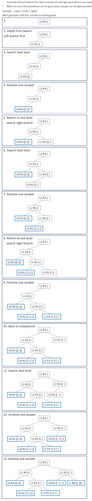

# 022. Generate Parentheses

Given n pairs of parentheses, write a function to generate all combinations of well-formed parentheses.

[LeetCode](https://leetcode.com/problems/generate-parentheses/)  

### Example 1:
```
Input: n = 3
Output: ["((()))","(()())","(())()","()(())","()()()"]
```

### Example 2:
```
Input: n = 1
Output: ["()"]
```

#  括號生成
數字 n 代表生成括號的對數，請你設計一個函數，用於能夠生成所有可能的並且 有效的 括號組合  

## Solution
* Depth First Search
* Recursion



### C

```
#define TRUE 1
#define FALSE 0

void fillParenthesis(char **space, int left, int right, int leftBranch, char *inputStr, int inputLen, int *returnSize)
{
    /* recursion end condition */
    if (left == 0)
    {
        char *result = (char *)calloc(inputLen + right + 1, sizeof(char));
        strcpy(result, inputStr);
        result[inputLen - 1] = '(';

        /* fill in right parenthesis *right times */
        for (int i = 0; i < right; ++i)
            result[inputLen + i] = ')';

        space[*returnSize] = result;
        ++*returnSize;
        return;
    }
    else if (left == right && left == 1)
    {
        char *result = (char *)calloc(inputLen + left + right + 1, sizeof(char));
        strcpy(result, inputStr);

        /* fill in parentheses ( ) */
        result[inputLen - 1] = ')';
        result[inputLen] = '(';
        result[inputLen + 1] = ')';

        space[*returnSize] = result;
        ++*returnSize;
        return;
    }

    /* fill in single parenthesis */
    char *Node = (char *)calloc(inputLen + 1, sizeof(char));
    strcpy(Node, inputStr);
    Node[inputLen] = '\0';
    if (leftBranch == TRUE)
        Node[inputLen - 1] = '(';
    else
        Node[inputLen - 1] = ')';

    /* searching next level */
    /* left branch */
    fillParenthesis(space, left - 1, right, TRUE, Node, inputLen + 1, returnSize);
    /*right branch */
    if (left < right)
        fillParenthesis(space, left, right - 1, FALSE, Node, inputLen + 1, returnSize);
    free(Node);
}

char **generateParenthesis(int n, int *returnSize)
{
    /* for input n = 1 */
    if (n == 1)
    {
        *returnSize = 1;
        char **result = (char **)malloc(sizeof(char *));
        char *ret = (char *)calloc(3, sizeof(char));
        strcpy(ret, "()");
        result[0] = ret;
        return result;
    }

    /* Top level need 2 byte to store '(' and sentinel '\0' */
    int strLen = 2;

    /* set starting point stringletter at  position: 0*/
    char start[] = "(";
    int left = n - 1; /* one left parenthesis used above */
    int right = n;
    *returnSize = 0;

    /* create space to restore result*/
    int levelValue = 2 * (n - 1) - 1;
    char **result = malloc(sizeof(char *) * pow(2, levelValue));

    /* left branch */
    fillParenthesis(result, left - 1, right, TRUE, start, strLen, returnSize);
    /* right branch */
    fillParenthesis(result, left, right - 1, FALSE, start, strLen, returnSize);

    return result;
}
```
