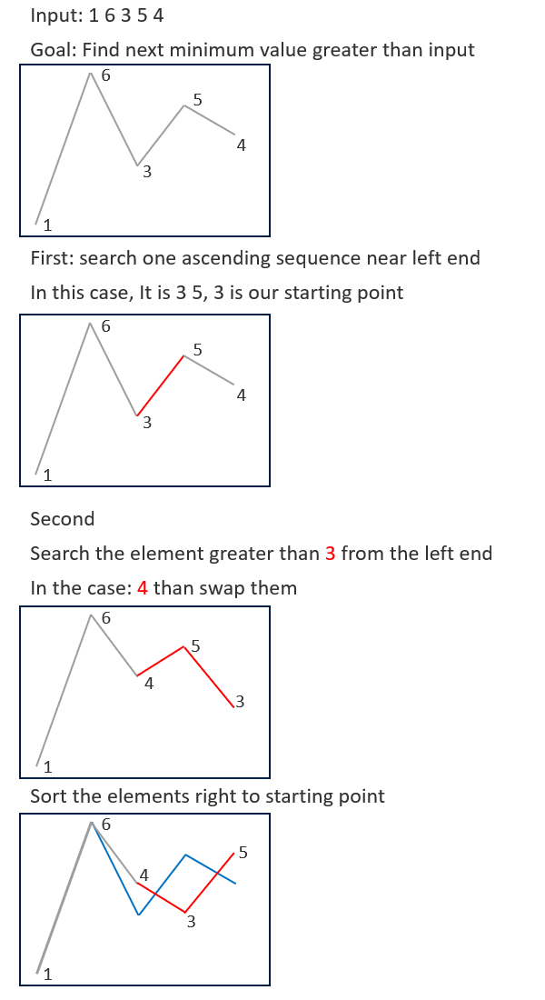

# 031. Next Permutation

Implement next permutation, which rearranges numbers into the lexicographically next greater permutation of numbers.

If such an arrangement is not possible, it must rearrange it as the lowest possible order (i.e., sorted in ascending order).

The replacement must be in place and use only constant extra memory.

[LeetCode](https://leetcode.com/problems/next-permutation)  

### Example 1:
```
Input: nums = [1,2,3]
Output: [1,3,2]
```

### Example 2:
```
Input: nums = [3,2,1]
Output: [1,2,3]
```

### Example 3:
```
Input: nums = [1,1,5]
Output: [1,5,1]
```

### Example 4:
```
Input: nums = [1]
Output: [1]
```

#  下一個排列
實現獲取 下一個排列 的函數，算法需要將給定數字序列重新排列成字典序中下一個更大的排列。

如果不存在下一個更大的排列，則將數字重新排列成最小的排列（即升序排列）。

必須 原地 修改，只允許使用額外常數空間


## Solution



### C++

* 時間複雜度：O(N)，其中 N 為給定序列的長度。我們至多只需要掃描兩次序列，以及進行一次反轉操作。

* 空間複雜度：O(1)，只需要常數的空間存放若幹變量。

```
class Solution
{
public:
    void nextPermutation(vector<int> &nums)
    {
        int len = nums.size();
        if (len <= 1)
            return;

        /* searh the number shall be swap later*/
        int i = len - 2;
        for (; i >= 0; --i)
        {
            if (nums[i] < nums[i + 1])
                break;
        }

        int targetId = i;
        if (i >= 0)
        {
            int target = nums[i];
            /* searh the number greater than target from the right end - range (i, end]*/

            for (i = len - 1; i > targetId; --i)
            {
                if (nums[i] > target)
                {
                    swap(nums[targetId], nums[i]);
                    break;
                }
            }
        }
        
        sort(nums.begin() + targetId + 1, nums.end());
    }
};
```

### C


```
#define SWAP(a, b) \
    a = a + b;     \
    b = a - b;     \
    a = a - b;

int comp(const void *a, const void *b)
{
    return (*(int *)a - *(int *)b);
}

void nextPermutation(int *nums, int numsSize)
{
    if (numsSize == 1)
        return;
    /* find the first ascending pair*/
    int i = numsSize - 1;
    while (i > 0 && nums[i - 1] >= nums[i])
        --i;

    int startAscend = i - 1;
    if (startAscend != -1)
    {
        /* find the most right element that biggeer than nums[startAscend] */
        i = numsSize - 1;
        while (i > startAscend && nums[i] <= nums[startAscend])
            --i;
        SWAP(nums[i], nums[startAscend]);
    }
    qsort(nums + startAscend + 1, numsSize - startAscend - 1, sizeof(int), comp);
}
```
