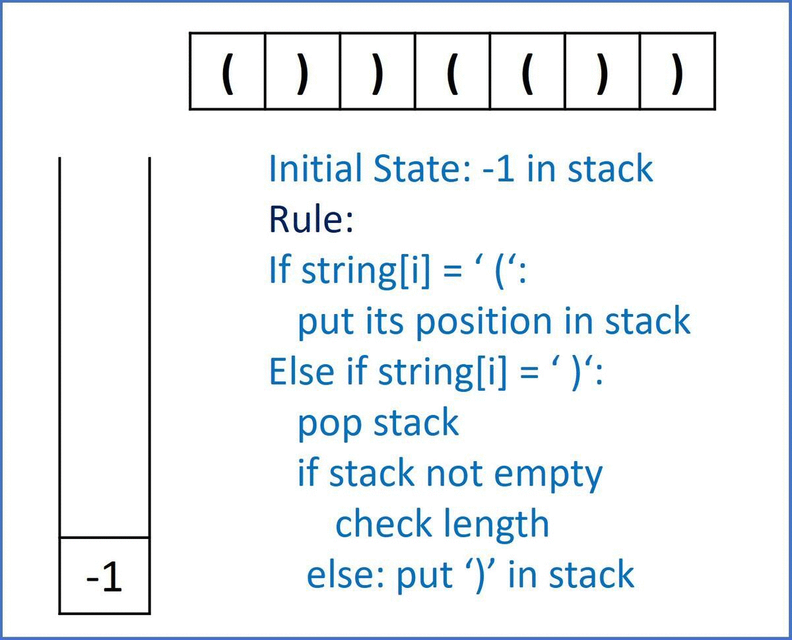

# 032. Longest Valid Parentheses

Given a string containing just the characters '(' and ')', find the length of the longest valid (well-formed) parentheses substring.

[LeetCode](https://leetcode.com/problems/longest-valid-parentheses)  

### Example 1:
```
Input: s = "(()"
Output: 2
Explanation: The longest valid parentheses substring is "()".
```

### Example 2:
```
Input: s = ")()())"
Output: 4
Explanation: The longest valid parentheses substring is "()()".
```

### Example 3:
```
Input: s = ""
Output: 0
```

### Constraints:

0 <= s.length <= 3 * 10^4
s[i] is '(', or ')'.

# 最長有效括號

給你一個只包含 '(' 和 ')' 的字符串，找出最長有效（格式正確且連續）括號子串的長度。

## Solution
* stack



### C++

```
#include <stack>
#include <string>

using namespace std;

class Solution
{
public:
    int longestValidParentheses(string s)
    {
        int strLen = s.size();
        
        /* create a stack and put a virtual '(' at index -1 in stack*/
        stack<int> position;
        position.push(-1);
        
        int maxLen = 0;
        for (int id = 0; id < strLen; ++id)
        {
            if (s[id] == '(')
            {
                position.push(id);
            }
            else if(s[id] == ')')
            {
                if (position.empty() != true)
                {
                    position.pop();
                    if(position.empty() != true)
                        maxLen = id-position.top() > maxLen? id-position.top(): maxLen;
                    else
                        position.push(id);
                }
            }
        }

        return maxLen;
    }
};

int main()
{
    /* Input*/
    string input = ")()())";

    /* unit test*/
    Solution test;
    int res = test.longestValidParentheses(input);

    return 0;
}
```