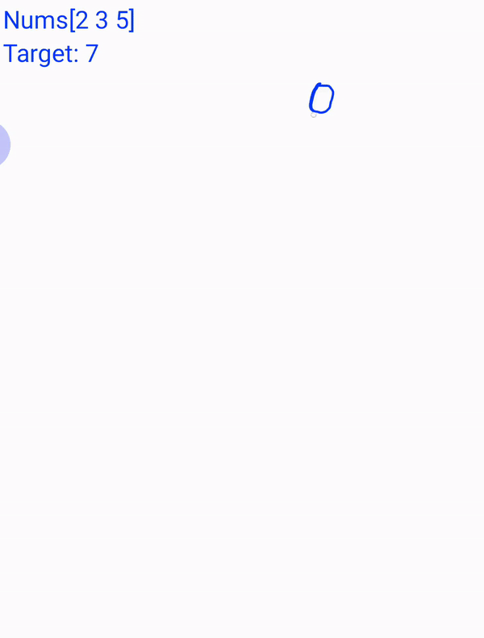

# 039. Combination Sum

Given an array of distinct integers candidates and a target integer target, return a list of all unique combinations of candidates where the chosen numbers sum to target. You may return the combinations in any order.

The same number may be chosen from candidates an unlimited number of times. Two combinations are unique if the frequency of at least one of the chosen numbers is different.

It is guaranteed that the number of unique combinations that sum up to target is less than 150 combinations for the given input

[LeetCode](https://leetcode.com/problems/combination-sum)  

### Example 1:
```
Input: candidates = [2,3,6,7], target = 7
Output: [[2,2,3],[7]]
Explanation:
2 and 3 are candidates, and 2 + 2 + 3 = 7. Note that 2 can be used multiple times.
7 is a candidate, and 7 = 7.
These are the only two combinations.

```

### Example 2:
```
Input: candidates = [2,3,5], target = 8
Output: [[2,2,2,2],[2,3,3],[3,5]]
```

### Example 3:
```
Input: candidates = [2], target = 1
Output: []
```

### Exaample 4:
```
Input: candidates = [1], target = 1
Output: [[1]]
```

#  組合總合
給定一個無重覆元素的數組 candidates 和一個目標數 target ，找出 candidates 中所有可以使數字和為 target 的組合。

candidates 中的數字可以無限制重覆被選取。

說明：

所有數字（包括 target）都是正整數。
解集不能包含重覆的組合


## Solution
Depth First Search


### C

```
int comp(const void *a, const void *b)
{
    return (*(int *)a - *(int *)b);
}

void depthFirstSearch(int preLvValue, int thisValue, const int *path, const int *id, const int *target, const int *nums,
                      const int *numsSize, int *returnSize, int **returnColumnSizes, int **retArray)
{
    thisValue += nums[*id];

    /* store info in this level*/
    int *newPath = (int *)malloc(sizeof(int) * (preLvValue + 1));
    memcpy(newPath, path, sizeof(int) * preLvValue);
    newPath[preLvValue] = nums[*id];

    if (thisValue == *target)
    {
        /* store result in space*/
        retArray[*returnSize] = newPath;
        (*returnColumnSizes)[*returnSize] = preLvValue + 1;

        ++*returnSize;
        return;
    }

    for (int addId = *id; addId < *numsSize; ++addId)
    {
        if (nums[addId] + thisValue > *target)
            break;
        depthFirstSearch(preLvValue + 1, thisValue, newPath, &addId, target, nums, numsSize, returnSize, returnColumnSizes, retArray);
    }

    free(newPath);
}

int **combinationSum(int *candidates, int candidatesSize, int target, int *returnSize, int **returnColumnSizes)
{
    *returnSize = 0;
    qsort(candidates, candidatesSize, sizeof(int), comp);

    /*allocate space for storing reslut */
    unsigned maxLen = 1000;   

    *returnColumnSizes = (int *)malloc(sizeof(int) * maxLen);
    int **retArray = (int **)malloc(sizeof(int *) * maxLen);

    /* set initial point */
    int value = 0;
    int lv = 0;
    int path[1] = {0}; /*dummy path */
    for (int addId = 0; addId < candidatesSize; ++addId)
        depthFirstSearch(lv, 0, path, &addId, &target, candidates, &candidatesSize, returnSize, returnColumnSizes, retArray);

    return retArray;
}

int main()
{
    int target = 69;
    int input[] = {48, 22, 49, 24, 26, 47, 33, 40, 37, 39, 31, 46, 36, 43, 45, 34, 28, 20, 29, 25, 41, 32, 23};
    int size = sizeof(input) / sizeof(input[0]);

    int returnSize = 0;
    int **returnColumnSizes = (int **)malloc(sizeof(int *));

    int **ans = combinationSum(input, size, target, &returnSize, returnColumnSizes);

    for (int i = 0; i < returnSize; ++i)
    {
        int len = (*returnColumnSizes)[i];
        printf("result %d: ", i);
        for (int j = 0; j < len; j++)
            printf("%d ", ans[i][j]);
        printf("\n");
    }

    return 0;
}
```
