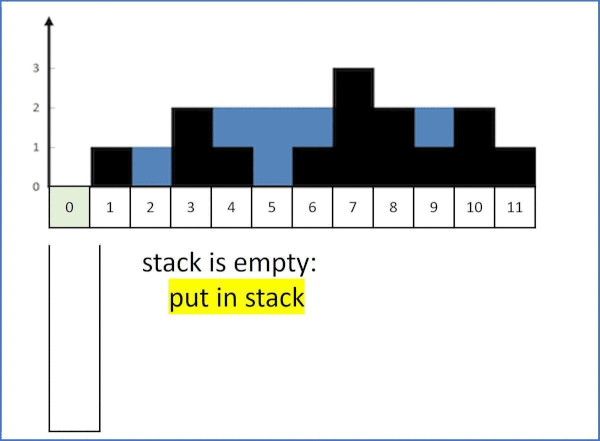

# 042. Trapping Rain Water

Given n non-negative integers representing an elevation map where the width of each bar is 1, compute how much water it can trap after raining.

[LeetCode](https://leetcode.com/problems/trapping-rain-water)  

### Example 1:


```
Input: height = [0,1,0,2,1,0,1,3,2,1,2,1]
Output: 6
Explanation: The above elevation map (black section) is represented by array [0,1,0,2,1,0,1,3,2,1,2,1]. In this case, 6 units of rain water (blue section) are being trapped.
```

### Example 2:
```
Input: height = [4,2,0,3,2,5]
Output: 9
```

### Constraints:

* n == height.length
* 0 <= n <= 3 * 10^4
* 0 <= height[i] <= 10^5

# 接雨水

給定 n 個非負整數表示每個寬度為 1 的柱子的高度圖，計算按此排列的柱子，下雨之後能接多少雨水。

## Solution
* stack




### C++

```
#include <vector>
#include <cmath>

using namespace std;

class Solution
{
public:
    int trap(vector<int> &height)
    {

        int len = height.size();
        int volume = 0;

        stack<int> wall;

        for (int i = 0; i < len; ++i)
        {
                while (wall.empty() != true)
                {
                    int prev = wall.top();
                    if (height[i] <= height[prev])
                        break;                    
                    else
                    {
                        wall.pop();
                        if (wall.empty() != true)
                            volume += (min(height[i], height[wall.top()]) - height[prev]) * (i - wall.top()-1);
                    }
                }
                wall.push(i);
        }

        return volume;
    }
};

int main()
{
    /* Input*/
    vector<int> input = {0, 1, 0, 2, 1, 0, 1, 3, 2, 1, 2, 1};

    /* unit test*/
    Solution test;
    int res = test.trap(input);

    return 0;
}
```