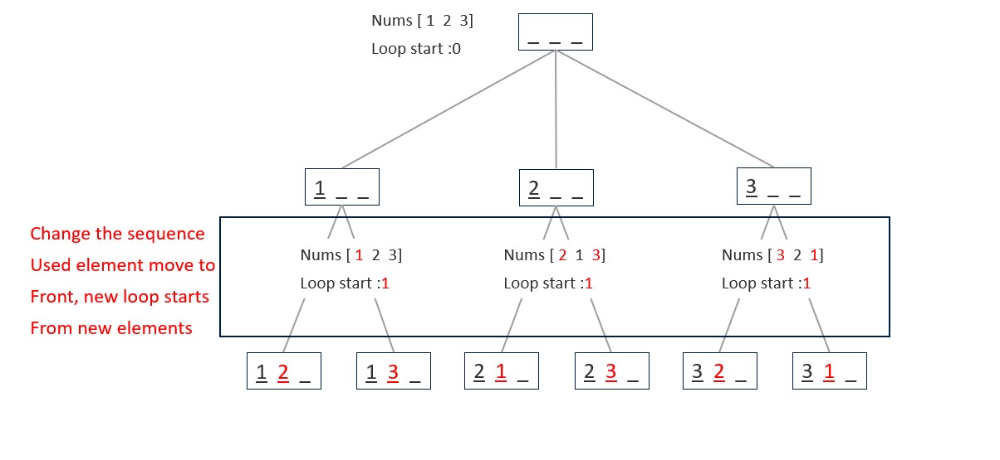

# 046. Permutation

Given an array nums of distinct integers, return all the possible permutations. You can return the answer in any order

[LeetCode](https://leetcode.com/problems/permutations)  

### Example 1:
```
Input: nums = [1,2,3]
Output: [[1,2,3],[1,3,2],[2,1,3],[2,3,1],[3,1,2],[3,2,1]]
```

### Example 2:
```
Input: nums = [0,1]
Output: [[0,1],[1,0]]
```

### Example 3:
```
Input: nums = [1]
Output: [[1]]
```

### Exaample 4:
```
Input: candidates = [1], target = 1
Output: [[1]]
```

#  全排列
給定一個沒有重複數字的序列，返回其所有可能的全排列

## Solution
Depth First Search


### C

```
#define TRUE 1

void swap(int *input, int src, int target)
{
    int tmp = input[src];
    input[src] = input[target];
    input[target] = tmp;
}

void depthFirstSearch(const int *addId, int *input, const int preLvValue, const int *nums, const int *numsSize, const int *preNums,
                      int *returnSize, int **returnColumnSizes, int **retArray)
{
    /* record element been used in last level by moving used element to front */
    int *newNums = (int *)malloc(sizeof(int) * (*numsSize));
    memcpy(newNums, preNums, sizeof(int) * (*numsSize));
    /* swap the nums[preLvValue] and nums [addId]*/
    if (preLvValue > 0)
        swap(newNums, preLvValue - 1, *addId);

    /* copy input to a new list*/
    int *newList = (int *)calloc(preLvValue + 1, sizeof(int));
    memcpy(newList, input, sizeof(int) * preLvValue);

    /* assigned new element to list*/
    for (int i = preLvValue; i < *numsSize; ++i)
    {
        newList[preLvValue] = newNums[i];
        if (preLvValue + 1 == *numsSize) /* record result */
        {
            retArray[*returnSize] = newList;
            (*returnColumnSizes)[*returnSize] = preLvValue + 1;
            ++*returnSize;
            free(newNums);
            return;
        }
        else
        {
            depthFirstSearch(&i, newList, preLvValue + 1, nums, numsSize, newNums, returnSize, returnColumnSizes, retArray);
        }
    }
    free(newList);
    free(newNums);
}

int **permute(int *nums, int numsSize, int *returnSize, int **returnColumnSizes)
{
    *returnSize = 0;
    /* space to restore result*/
    int retLen = 1;
    int i = 0;
    for (i = 1; i <= numsSize; ++i)
        retLen *= i;
    int **retArray = (int **)malloc(sizeof(int *) * retLen);
    *returnColumnSizes = (int *)calloc(retLen, sizeof(int));

    /* initial point*/
    int start[1] = {0};

    /* Depth First Search*/
    depthFirstSearch(NULL, start, 0, nums, &numsSize, nums, returnSize, returnColumnSizes, retArray);

    return retArray;
}

int main()
{
    int input[] = {1, 2, 3, 4};
    int size = sizeof(input) / sizeof(input[0]);

    int returnSize = 0;
    int **returnColumnSizes = (int **)malloc(sizeof(int *));

    int **ans = permute(input, size, &returnSize, returnColumnSizes);

    for (int i = 0; i < returnSize; ++i)
    {
        int len = (*returnColumnSizes)[i];
        printf("result %2d: ", i + 1);
        for (int j = 0; j < len; j++)
            printf("%d ", ans[i][j]);
        printf("\n");
    }

    return 0;
}
```
