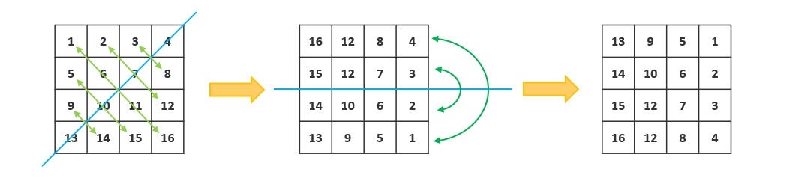

# 048. Rotate Image

You are given an n x n 2D matrix representing an image, rotate the image by 90 degrees (clockwise).

You have to rotate the image in-place, which means you have to modify the input 2D matrix directly. DO NOT allocate another 2D matrix and do the rotation.

##  旋轉圖像
給定一個 n × n 的二維矩陣 matrix 表示一個圖像。請你將圖像順時針旋轉 90 度。

你必須在 原地 旋轉圖像，這意味著你需要直接修改輸入的二維矩陣。請不要 使用另一個矩陣來旋轉圖像

[LeetCode](https://leetcode.com/problems/rotate-image)  

### Example 1:

```
Input: matrix = [[1,2,3],[4,5,6],[7,8,9]]
Output: [[7,4,1],[8,5,2],[9,6,3]]
```

### Example 2:

```
Input: matrix = [[5,1,9,11],[2,4,8,10],[13,3,6,7],[15,14,12,16]]
Output: [[15,13,2,5],[14,3,4,1],[12,6,8,9],[16,7,10,11]]
```

### Example 3:
```
Input: matrix = [[1]]
Output: [[1]]
```

### Exaample 4:
```
Input: matrix = [[1,2],[3,4]]
Output: [[3,1],[4,2]]
```

## Solution


### C++
```
#include <vector>

using namespace std;

class Solution
{
public:
    void rotate(vector<vector<int>> &matrix)
    {
        int rowNum = matrix.size();
        int colNum = matrix[0].size();

        /* swap elements diagnoaly*/
        for (int row = 0; row < rowNum - 1; ++row)
        {
            for (int col = 0; col < colNum - 1 - row; ++col)
            {
                swap(matrix[row][col],matrix[colNum - col - 1][rowNum - row - 1]);
            }
        }

        int top = 0;
        int bottom = rowNum-1;
        while (top < bottom)
        {
            swap(matrix[top++], matrix[bottom--]);
        }
    }
};

int main()
{
    vector<vector<int>> input = {{5, 1, 9, 11},
                                 {2, 4, 8, 10},
                                 {13, 3, 6, 7},
                                 {15, 14, 12, 16}};

    /* unit test*/
    Solution test;
    test.rotate(input);

    return 0;
}
```

### C

```
void rotate(int **matrix, int matrixSize, int *matrixColSize)
{
    int row = 0;
    int col = 0;
    int tmp = 0;

    for (row = 0; row < matrixSize - 1; ++row)
    {
        for (col = 0; col < *matrixColSize - 1 - row; ++col)
        {
            tmp = matrix[row][col];
            matrix[row][col] = matrix[matrixSize - 1 - col][*matrixColSize - 1 - row];
            matrix[matrixSize - 1 - col][*matrixColSize - 1 - row] = tmp;
        }
    }

    int *tmpRow = NULL;

    for (row = 0; row < matrixSize / 2; ++row)
    {
        tmpRow = matrix[row];
        matrix[row] = matrix[matrixSize - 1 - row];
        matrix[matrixSize - 1 - row] = tmpRow;
    }
}

int main()
{

    int a[] = {1, 2, 3, 4};
    int b[] = {5, 6, 7, 8};
    int c[] = {9, 10, 11, 12};
    int d[] = {13, 14, 15, 16};

    int **input = (int **)malloc(sizeof(int *) * 4);
    input[0] = a;
    input[1] = b;
    input[2] = c;
    input[3] = d;

    int size = 4;
    
    for (int i = 0; i < size; ++i)
    {
        for (int j = 0; j < size; ++j)
            printf("%2d ", input[i][j]);
        printf("\n");
    }
    printf("\n");

    rotate(input, size, &size);

    for (int i = 0; i < size; ++i)
    {
        for (int j = 0; j < size; ++j)
            printf("%2d ", input[i][j]);
        printf("\n");
    }

    return 0;
}
```
