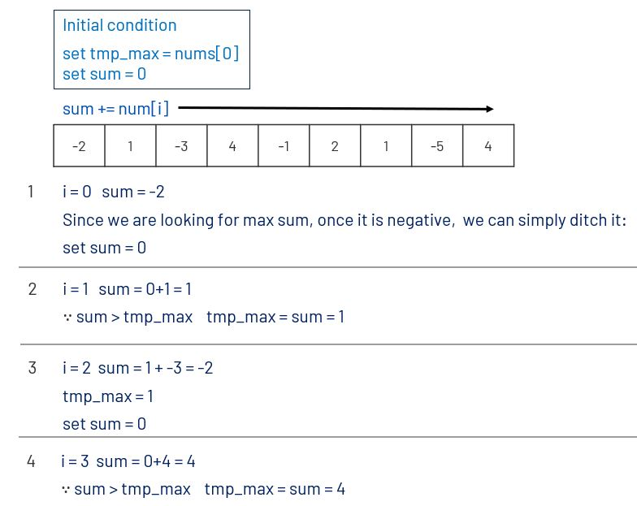

# 053. Two Sum
Given an integer array nums, find the contiguous subarray (containing at least one number) which has the largest sum and return its sum.

Follow up: If you have figured out the O(n) solution, try coding another solution using the divide and conquer approach, which is more subtle.

[LeetCode](https://leetcode.com/problems/two-sum/)  

### Example 1:
```
Input: nums = [-2,1,-3,4,-1,2,1,-5,4]
Output: 6
Explanation: [4,-1,2,1] has the largest sum = 6.
```

### Example 2:
```
Input: nums = [1]
Output: 1
```

# 最大子序和
给定一个整数数组 nums ，找到一个具有最大和的连续子数组（子数组最少包含一个元素），返回其最大和。  

## Solution


### C
```
int maxSubArray(int* nums, int numsSize){
    
    int tmp_max = nums[0]; 
    int sum = 0;
    for(int i = 0; i < numsSize; i++){
        sum += nums[i];
        tmp_max = (sum > tmp_max? sum:tmp_max);
        if (sum < 0)
            sum = 0;
                           
    }

    return tmp_max;
}
```


