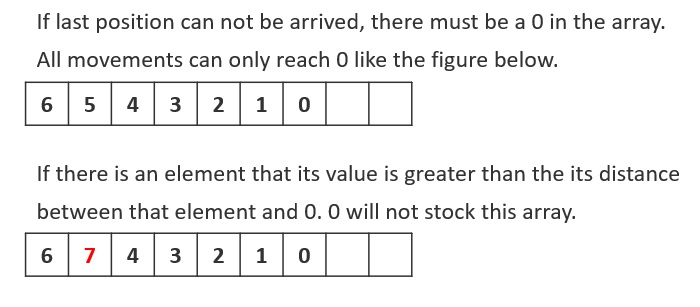

# 055. Jump Game

Given an array of non-negative integers nums, you are initially positioned at the first index of the array.

Each element in the array represents your maximum jump length at that position.

Determine if you are able to reach the last index.

[LeetCode](https://leetcode.com/problems/ump-game)  

### Example 1:

```
Input: nums = [2,3,1,1,4]
Output: true
Explanation: Jump 1 step from index 0 to 1, then 3 steps to the last index.
```

### Example 2:
```
Input: nums = [3,2,1,0,4]
Output: false
Explanation: You will always arrive at index 3 no matter what. Its maximum jump length is 0, which makes it impossible to reach the last index.
```

#  跳躍遊戲
給定一個非負整數數組，你最初位於數組的第一個位置。

數組中的每個元素代表你在該位置可以跳躍的最大長度。

判斷你是否能夠到達最後一個位置

## Solution

### C
* Try different solution than greedy algorithm


```
bool canJump(int *nums, int numsSize)
{
    if (numsSize > 1 && *nums == 0)
        return false;
    else if (numsSize == 1)
        return true;

    bool ret = true;
    int zPos = 0;
    for (int i = numsSize - 2; i >= 0; --i)
    {
        if (nums[i] == 0 && ret == true)
        {
            ret = false;
            zPos = i;
            continue;
        }

        if (ret == false)
        {
            if (zPos - i < nums[i])
                ret = true;
        }
    }

    return ret;
}

int main()
{
    int input[] = {0};
    bool ans = canJump(input, sizeof(input) / sizeof(input[0]));

    return 0;
}
```
