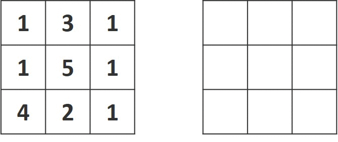

# 064. Minimum Path Sum

Given a m x n grid filled with non-negative numbers, find a path from top left to bottom right, which minimizes the sum of all numbers along its path.

Note: You can only move either down or right at any point in time.

[LeetCode](https://leetcode.com/problems/minimum-path-sum)  

### Example 1:


```
Input: grid = [[1,3,1],[1,5,1],[4,2,1]]
Output: 7
Explanation: Because the path 1 → 3 → 1 → 1 → 1 minimizes the sum.
```

#  最小路徑和
給定一個包含非負整數的 m x n 網格 grid ，請找出一條從左上角到右下角的路徑，使得路徑上的數字總和為最小。

說明：每次只能向下或者向右移動一步。

## Solution
* Dynamic Programming



### C

```
#include <math.h>

int minPathSum(int **grid, int gridSize, int *gridColSize)
{
    int i, j;
    int map[gridSize][*gridColSize];

    map[0][0] = grid[0][0];

    /*set bundary condition*/
    for (i = 1; i < *gridColSize; ++i)
        map[0][i] = map[0][i - 1] + grid[0][i];

    for (i = 1; i < gridSize; ++i)
        map[i][0] = map[i - 1][0] + grid[i][0];

    /* Dynamic Programming */
    for (i = 1; i < gridSize; ++i)
    {
        for (j = 1; j < *gridColSize; ++j)
            map[i][j] = fmin(map[i - 1][j], map[i][j - 1]) + grid[i][j];
    }
    return map[gridSize - 1][*gridColSize - 1];
}

int main()
{
    int gridSize = 2;
    int gridColSize = 2;

    int a[3] = {1, 2};
    int b[3] = {1, 1};
    

    int *grid[2] = {a, b};

    int ans = minPathSum(grid, gridSize, &gridColSize);

    return 0;
}
```
