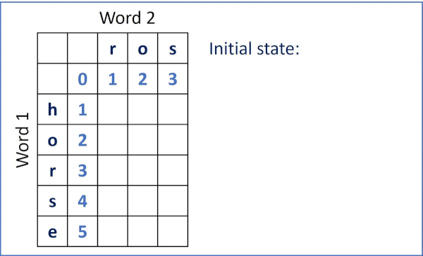

# 072. Edit Distance

Given two strings word1 and word2, return the minimum number of operations required to convert word1 to word2.

You have the following three operations permitted on a word:

* Insert a character
* Delete a character
* Replace a character

[LeetCode](https://leetcode.com/problems/edit-distance)  

### Example 1:

```
Input: word1 = "horse", word2 = "ros"
Output: 3
Explanation: 
horse -> rorse (replace 'h' with 'r')
rorse -> rose (remove 'r')
rose -> ros (remove 'e')
```

### Example 2:

```
Input: word1 = "intention", word2 = "execution"
Output: 5
Explanation: 
intention -> inention (remove 't')
inention -> enention (replace 'i' with 'e')
enention -> exention (replace 'n' with 'x')
exention -> exection (replace 'n' with 'c')
exection -> execution (insert 'u')
```

### Constraints:

* 0 <= word1.length, word2.length <= 500
* word1 and word2 consist of lowercase English letters.


# 編輯距離

給你兩個單詞 word1 和 word2，請你計算出將 word1 轉換成 word2 所使用的最少操作數 。

你可以對一個單詞進行如下三種操作：

* 插入一個字符
* 刪除一個字符
* 替換一個字符

## Solution
* Dynamic Programming



### C++

```
#include <string>
#include <vector>
#include <cmath>

using namespace std;

class Solution
{
private:
    inline int minValue(const vector<vector<int>> &dp, const int &row, const int &col) const
    {
        return min(min(dp[row - 1][col], dp[row - 1][col - 1]), dp[row][col - 1]);
    }

public:
    int minDistance(string word1, string word2)
    {
        int lenWd1 = word1.size();
        int lenWd2 = word2.size();

        /* create dynammic programming space */
        vector<vector<int>> dp(lenWd1 + 1, vector<int>(lenWd2 + 1, 0));

        /* initialize dp space*/
        int row = 0;
        int col = 0;

        for (; row <= lenWd1; ++row)
            dp[row][0] = row;

        for (; col <= lenWd2; ++col)
            dp[0][col] = col;

        /* dynammic programming*/
        for (row = 1; row <= lenWd1; ++row)
        {
            for (col = 1; col <= lenWd2; ++col)
            {
                if (word2[col - 1] == word1[row - 1])
                    dp[row][col] = dp[row - 1][col - 1];
                else 
                    /* min value from top, left, top-left*/
                    dp[row][col] = minValue(dp, row, col) + 1;
            }
        }

        return dp[lenWd1][lenWd2];
    }
};

int main()
{
    /* Input*/
    string word1 = "horse";
    string word2 = "ros";

    /* unit test*/
    Solution test;
    int res = test.minDistance(word1, word2);

    return 0;
}
```