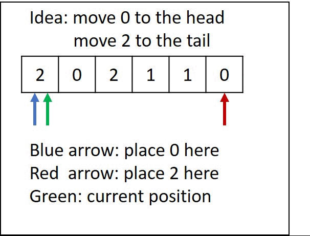

# 075. Sort Colors

Given an array nums with n objects colored red, white, or blue, sort them in-place so that objects of the same color are adjacent, with the colors in the order red, white, and blue.

We will use the integers 0, 1, and 2 to represent the color red, white, and blue, respectively.

[LeetCode](https://leetcode.com/problems/sort-colors)  

### Example 1:
```
Input: nums = [2,0,2,1,1,0]
Output: [0,0,1,1,2,2]
```

### Example 2:
```
Input: nums = [2,0,1]
Output: [0,1,2]
```

### Example 3:
```
Input: nums = [0]
Output: [0]
```

#  顏色分類
給定一個包含紅色、白色和藍色，一共 n 個元素的數組，原地對它們進行排序，使得相同顏色的元素相鄰，並按照紅色、白色、藍色順序排列。

此題中，我們使用整數 0、 1 和 2 分別表示紅色、白色和藍色

## Solution
* Dynamic Programming



### C

```
void swap(int *a, int *b)
{
    int tmp = *a;
    *a = *b;
    *b = tmp;
}

void sortColors(int *nums, int numsSize)
{
    int ptr0 = 0;
    int ptr2 = numsSize - 1;
    int i = 0;

    while (i <= ptr2)
    {
        if (nums[i] == 1)
            ++i;
        else if (nums[i] == 0)
        {
            if (ptr0 == i)
                ++i;
            else
                swap(&nums[ptr0], &nums[i]);
            ++ptr0;
        }
        else if (nums[i] == 2)
        {
            swap(&nums[ptr2], &nums[i]);
            --ptr2;
        }
    }
}

int array[] = {1, 2, 0};

int main()
{    
    sortColors(array, sizeof(array) / sizeof(array[0]));
    return 0;
}
```
