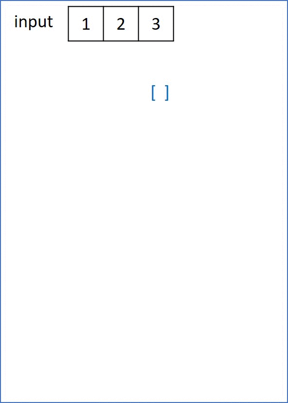

# 078. Subsets

Given an integer array nums of unique elements, return all possible subsets (the power set).

The solution set must not contain duplicate subsets. Return the solution in any order.

[LeetCode](https://leetcode.com/problems/subsets)  

### Example 1:
```
Input: nums = [1,2,3]
Output: [[],[1],[2],[1,2],[3],[1,3],[2,3],[1,2,3]]
```

### Example 2:
```
Input: nums = [0]
Output: [[],[0]]
```

#  子集
給你一個整數數組 nums ，數組中的元素 互不相同 。返回該數組所有可能的子集（冪集）。

解集 不能 包含重覆的子集。你可以按 任意順序 返回解集。

## Solution
* Dynamic Programming



### C

```
#define LEN 10000

void DFS(const int *nums, int *lastLv, int lastLvValue, int index, int *returnSize, int **returnColumnSizes, int **retArray, const int *numsSize)
{
    int *tmp = malloc((lastLvValue + 1) * sizeof(int));
    memcpy(tmp, lastLv, sizeof(int) * lastLvValue);
    tmp[lastLvValue] = nums[index];
    /* store the array just build */
    (*returnColumnSizes)[*returnSize] = lastLvValue + 1;
    retArray[*returnSize] = tmp;
    ++(*returnSize);

    /*recursion */
    for (int i = index + 1; i < *numsSize; ++i)
    {
        DFS(nums, tmp, lastLvValue + 1, i, returnSize, returnColumnSizes, retArray, numsSize);
    }
}

int **subsets(int *nums, int numsSize, int *returnSize, int **returnColumnSizes)
{
    *returnSize = 0;

    /*allocate space for storing reslut */
    *returnColumnSizes = (int *)calloc(LEN, sizeof(int));
    int **retArray = (int **)malloc(sizeof(int *) * LEN);

    /* store the subset {}, this is the initial info for depth first search*/
    int first[] = {};
    (*returnColumnSizes)[*returnSize] = 0;
    retArray[*returnSize] = first;
    ++(*returnSize);

    /* DFS algorithm */
    for (int i = 0; i < numsSize; ++i)
    {
        DFS(nums, first, 0, i, returnSize, returnColumnSizes, retArray, &numsSize);
    }

    return retArray;
}

int main()
{
    /* input */
    int nums[] = {1, 2, 3, 4, 5, 6, 7, 8, 10, 0};
    int returnSize = 0;
    int **returnColumnSizes = (int **)malloc(sizeof(int *));

    int **ans = subsets(nums, sizeof(nums) / sizeof(nums[0]), &returnSize, returnColumnSizes);

    /* print the result */
    for (int i = 0; i < returnSize; ++i)
    {
        int len = (*returnColumnSizes)[i];
        printf("%d. [ ", i);
        for (int j = 0; j < len; j++)
            printf("%i ", ans[i][j]);
        printf("] \n");
    }

    return 0;
}
```
